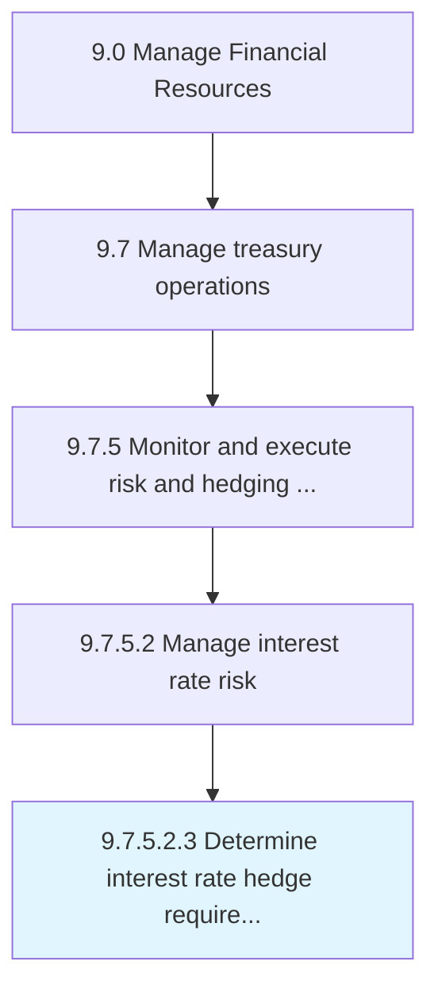

# Determine interest rate hedge requirements in accordance with risk policy

> Deciding the requirements on interest rate investments that are made by trading in futures or options market, on the basis of the accepted risk policy.

## Overview

Sub-Activity 9.7.5.2.3 is an activity within the Manage Financial Resources framework. 

Deciding the requirements on interest rate investments that are made by trading in futures or options market, on the basis of the accepted risk policy.

## Process Hierarchy



## Key Statistics

| Metric | Value |
|--------|-------|
| APQC Code | 19577 |
| Hierarchy ID | 9.7.5.2.3 |
| Level | Sub-Activity |
| Parent | [9.7.5.2](../) |
| Sub-Processes | 0 |


## GraphDL Semantic Structure

```
determine.InterestRateHedgeRequirements.in.AccordanceWithRiskPolicy
```

| Component | Value | Description |
|-----------|-------|-------------|
| Verb | `determine` | Primary action |
| Object | `interest rate hedge requirements` | Direct object |
| Preposition | `in` | Relationship |
| PrepObject | `accordance with risk policy` | Indirect object |


## Related Concepts

- InterestRateHedgeRequirements
- AccordanceWithRiskPolicy


---

*Source: APQC PCF 19577 (9.7.5.2.3) - APQC*
