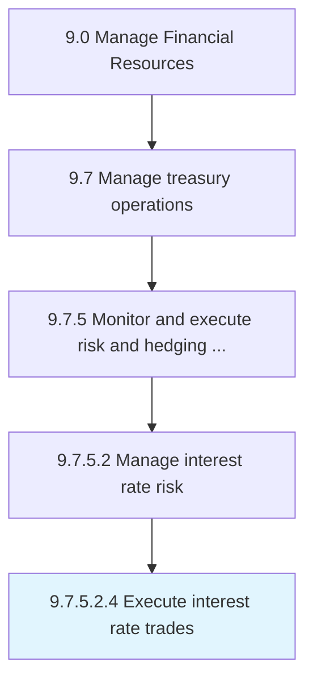

# Execute interest rate trades

> Performing trading on interest rates.

## Overview

Sub-Activity 9.7.5.2.4 is an activity within the Manage Financial Resources framework. 

## Process Hierarchy



## Key Statistics

| Metric | Value |
|--------|-------|
| APQC Code | 19578 |
| Hierarchy ID | 9.7.5.2.4 |
| Level | Sub-Activity |
| Parent | [9.7.5.2](../) |
| Sub-Processes | 0 |


## GraphDL Semantic Structure

```
execute.InterestRateTrades
```

| Component | Value | Description |
|-----------|-------|-------------|
| Verb | `execute` | Primary action |
| Object | `interest rate trades` | Direct object |


## Related Concepts

- InterestRateTrades


---

*Source: APQC PCF 19578 (9.7.5.2.4) - APQC*
