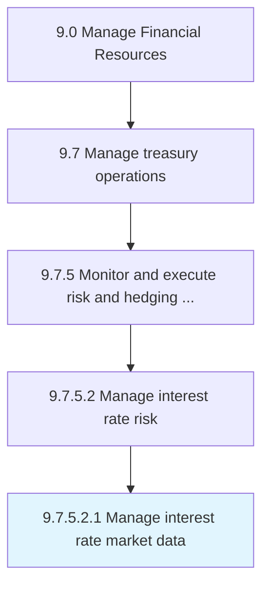

# Manage interest rate market data

> Collecting and storing data that pertains to interest rate markets.

## Overview

Sub-Activity 9.7.5.2.1 is an activity within the Manage Financial Resources framework. 

Collecting and storing data that pertains to interest rate markets.

## Process Hierarchy



## Key Statistics

| Metric | Value |
|--------|-------|
| APQC Code | 19575 |
| Hierarchy ID | 9.7.5.2.1 |
| Level | Sub-Activity |
| Parent | [9.7.5.2](../) |
| Sub-Processes | 0 |


## GraphDL Semantic Structure

```
manage.InterestRateMarketData
```

| Component | Value | Description |
|-----------|-------|-------------|
| Verb | `manage` | Primary action |
| Object | `interest rate market data` | Direct object |


## Related Concepts

- [InterestRateMarketData](/concepts/InterestRateMarketData)


---

*Source: APQC PCF 19575 (9.7.5.2.1) - APQC*
