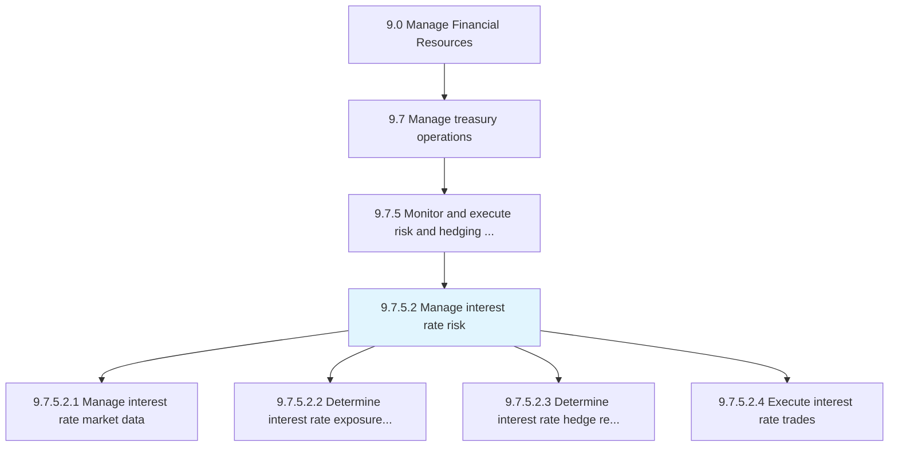
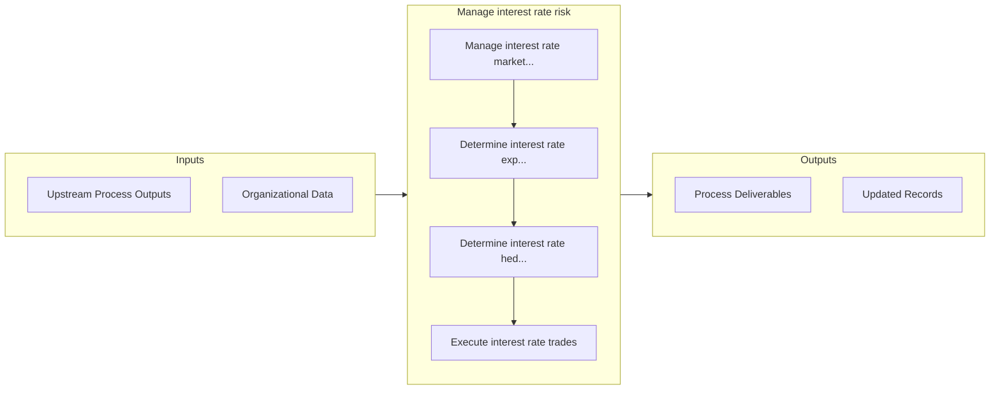

# Manage interest rate risk

> Handling risks arising from changes in the interest rate.

## Overview

Activity 9.7.5.2 is an activity within the Manage Financial Resources framework. 

Handling risks arising from changes in the interest rate.

## Process Hierarchy



## Key Statistics

| Metric | Value |
|--------|-------|
| APQC Code | 11209 |
| Hierarchy ID | 9.7.5.2 |
| Level | Activity |
| Parent | [9.7.5](../) |
| Sub-Processes | 4 |


## GraphDL Semantic Structure

```graphdl
manage.InterestRateRisk
```

| Component | Value | Description |
|-----------|-------|-------------|
| Verb | `manage` | Primary action |
| Object | `interest rate risk` | Direct object |


## Process Flow



## Sub-Processes

| Process | Hierarchy ID | Description |
|---------|-------------|-------------|
| [Manage interest rate market data](./ManageInterestRateMarketData) | 9.7.5.2.1 | Collecting and storing data that pertains to interest rate markets |
| [Determine interest rate exposure for all markets](./DetermineInterestRateExposureForAllMarkets) | 9.7.5.2.2 | Identifying potential interest rate risks for all markets |
| [Determine interest rate hedge requirements in accordance with risk policy](./DetermineInterestRateHedgeRequirementsInAccordanceWithRiskPolicy) | 9.7.5.2.3 | Deciding the requirements on interest rate investments that are made by trading in futures or option |
| [Execute interest rate trades](./ExecuteInterestRateTrades) | 9.7.5.2.4 | Performing trading on interest rates |


## Related Concepts

- InterestRateRisk


---

*Source: APQC PCF 11209 (9.7.5.2) - APQC*
