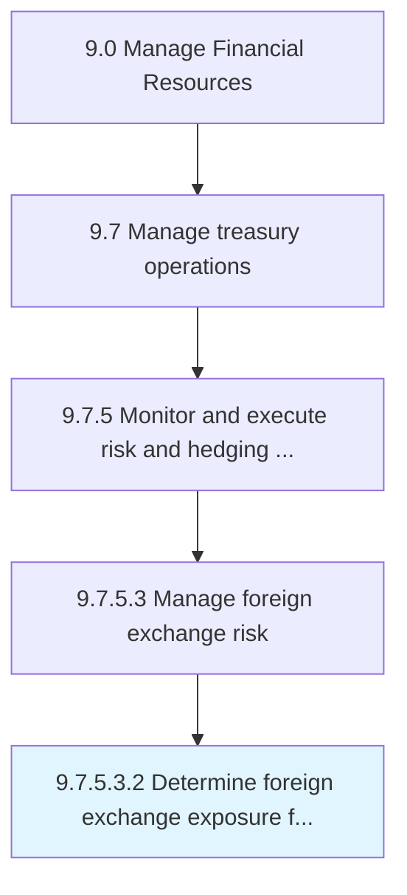

# Determine foreign exchange exposure for all currencies

> Establishing potential foreign exchange risks for all currencies.

## Overview

Sub-Activity 9.7.5.3.2 is an activity within the Manage Financial Resources framework. 

Establishing potential foreign exchange risks for all currencies.

## Process Hierarchy



## Key Statistics

| Metric | Value |
|--------|-------|
| APQC Code | 19580 |
| Hierarchy ID | 9.7.5.3.2 |
| Level | Sub-Activity |
| Parent | [9.7.5.3](../) |
| Sub-Processes | 0 |


## GraphDL Semantic Structure

```
determine.ForeignExchangeExposure.for.AllCurrencies
```

| Component | Value | Description |
|-----------|-------|-------------|
| Verb | `determine` | Primary action |
| Object | `foreign exchange exposure` | Direct object |
| Preposition | `for` | Relationship |
| PrepObject | `all currencies` | Indirect object |


## Related Concepts

- [ForeignExchangeExposure](/concepts/ForeignExchangeExposure)
- [Currencies](/concepts/Currencies)


---

*Source: APQC PCF 19580 (9.7.5.3.2) - APQC*
