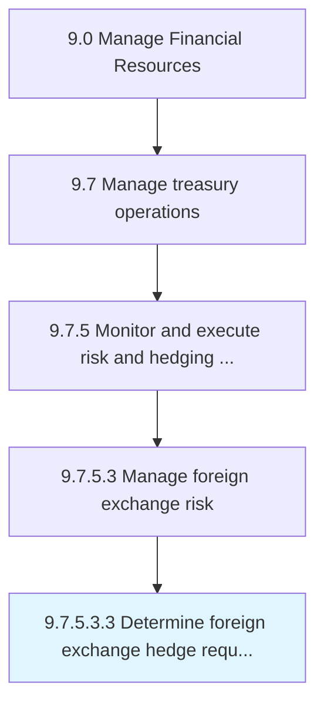

# Determine foreign exchange hedge requirements in accordance with risk policy

> Deciding the requirements on investments in foreign exchange made by trading in futures or options market, on the basis of current risk policy.

## Overview

Sub-Activity 9.7.5.3.3 is an activity within the Manage Financial Resources framework. 

Deciding the requirements on investments in foreign exchange made by trading in futures or options market, on the basis of current risk policy.

## Process Hierarchy



## Key Statistics

| Metric | Value |
|--------|-------|
| APQC Code | 19581 |
| Hierarchy ID | 9.7.5.3.3 |
| Level | Sub-Activity |
| Parent | [9.7.5.3](../) |
| Sub-Processes | 0 |


## GraphDL Semantic Structure

```
determine.ForeignExchangeHedgeRequirements.in.AccordanceWithRiskPolicy
```

| Component | Value | Description |
|-----------|-------|-------------|
| Verb | `determine` | Primary action |
| Object | `foreign exchange hedge requirements` | Direct object |
| Preposition | `in` | Relationship |
| PrepObject | `accordance with risk policy` | Indirect object |


## Related Concepts

- [ForeignExchangeHedgeRequirements](/concepts/ForeignExchangeHedgeRequirements)
- [AccordanceWithRiskPolicy](/concepts/AccordanceWithRiskPolicy)


---

*Source: APQC PCF 19581 (9.7.5.3.3) - APQC*
