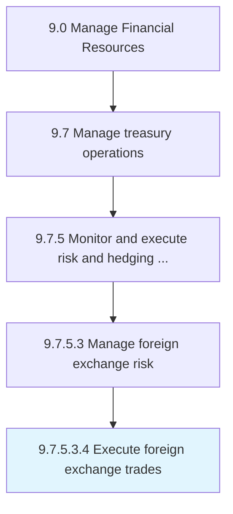

# Execute foreign exchange trades

> Executing all aspects for foreign exchange trade within foreign exchange market.

## Overview

Sub-Activity 9.7.5.3.4 is an activity within the Manage Financial Resources framework. 

Executing all aspects for foreign exchange trade within foreign exchange market. This includes buying, selling, and exchanging currencies at the current or expressed price point.

## Process Hierarchy



## Key Statistics

| Metric | Value |
|--------|-------|
| APQC Code | 19582 |
| Hierarchy ID | 9.7.5.3.4 |
| Level | Sub-Activity |
| Parent | [9.7.5.3](../) |
| Sub-Processes | 0 |


## GraphDL Semantic Structure

```
execute.ForeignExchangeTrades
```

| Component | Value | Description |
|-----------|-------|-------------|
| Verb | `execute` | Primary action |
| Object | `foreign exchange trades` | Direct object |


## Related Concepts

- [ForeignExchangeTrades](/concepts/ForeignExchangeTrades)


---

*Source: APQC PCF 19582 (9.7.5.3.4) - APQC*
