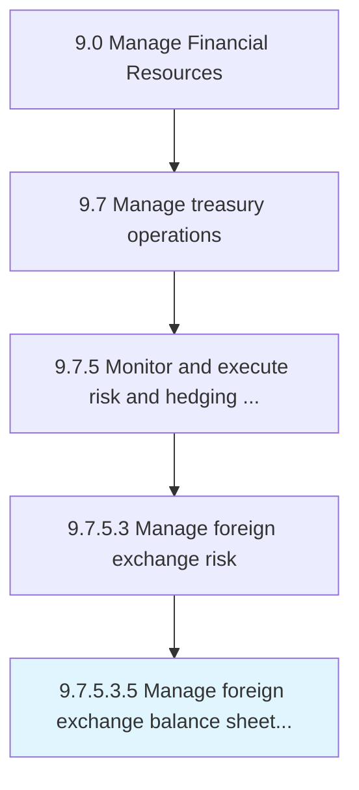

# Manage foreign exchange balance sheet risk

> Overseeing the foreign exchange balance sheet with an eye towards potential risk.

## Overview

Sub-Activity 9.7.5.3.5 is an activity within the Manage Financial Resources framework. 

Overseeing the foreign exchange balance sheet with an eye towards potential risk. Risks include changes in conversion rates between the time the transaction occurred and when it is completed, or when transactions are made in a denomination other than that of the organization's base currency.

## Process Hierarchy



## Key Statistics

| Metric | Value |
|--------|-------|
| APQC Code | 19583 |
| Hierarchy ID | 9.7.5.3.5 |
| Level | Sub-Activity |
| Parent | [9.7.5.3](../) |
| Sub-Processes | 0 |


## GraphDL Semantic Structure

```
manage.ForeignExchangeBalanceSheetRisk
```

| Component | Value | Description |
|-----------|-------|-------------|
| Verb | `manage` | Primary action |
| Object | `foreign exchange balance sheet risk` | Direct object |


## Related Concepts

- ForeignExchangeBalanceSheetRisk


---

*Source: APQC PCF 19583 (9.7.5.3.5) - APQC*
