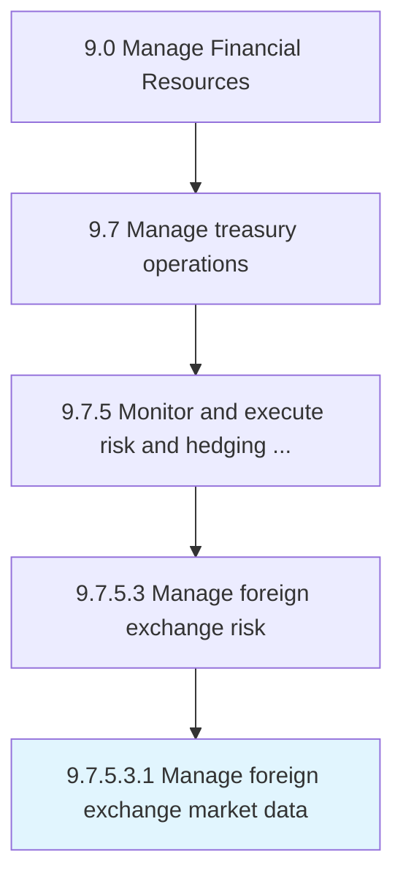

# Manage foreign exchange market data

> Handling and processing information about changes in foreign exchange rates.

## Overview

Sub-Activity 9.7.5.3.1 is an activity within the Manage Financial Resources framework. 

Handling and processing information about changes in foreign exchange rates.

## Process Hierarchy



## Key Statistics

| Metric | Value |
|--------|-------|
| APQC Code | 19579 |
| Hierarchy ID | 9.7.5.3.1 |
| Level | Sub-Activity |
| Parent | [9.7.5.3](../) |
| Sub-Processes | 0 |


## GraphDL Semantic Structure

```
manage.ForeignExchangeMarketData
```

| Component | Value | Description |
|-----------|-------|-------------|
| Verb | `manage` | Primary action |
| Object | `foreign exchange market data` | Direct object |


## Related Concepts

- [ForeignExchangeMarketData](/concepts/ForeignExchangeMarketData)


---

*Source: APQC PCF 19579 (9.7.5.3.1) - APQC*
