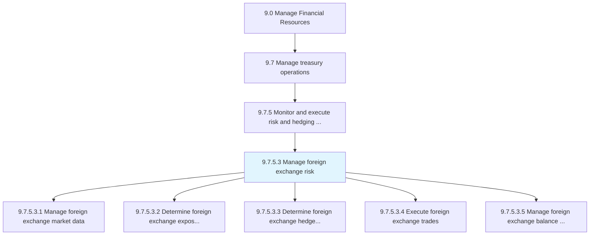
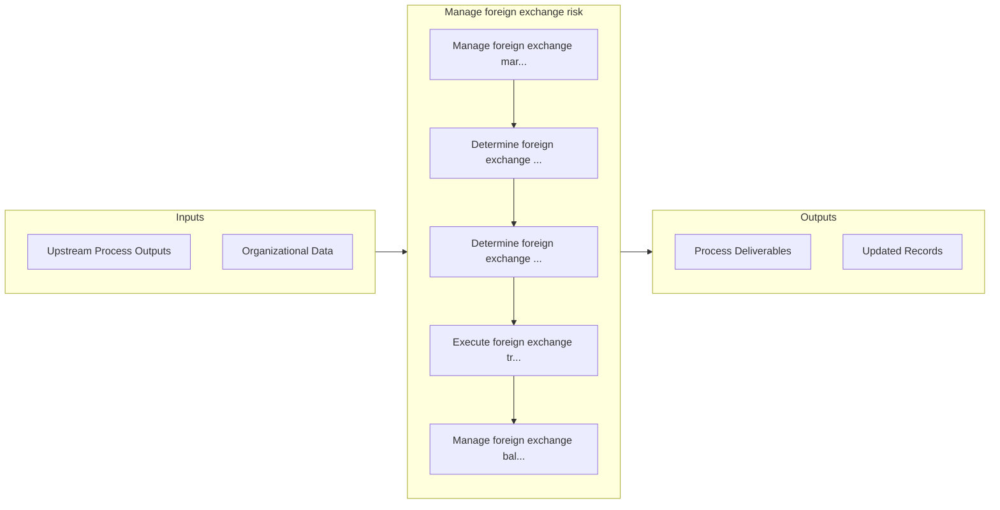

# Manage foreign exchange risk

> Taking care of foreign-exchange risks.

## Overview

Activity 9.7.5.3 is an activity within the Manage Financial Resources framework. 

## Process Hierarchy



## Key Statistics

| Metric | Value |
|--------|-------|
| APQC Code | 11210 |
| Hierarchy ID | 9.7.5.3 |
| Level | Activity |
| Parent | [9.7.5](../) |
| Sub-Processes | 5 |


## GraphDL Semantic Structure

```graphdl
manage.ForeignExchangeRisk
```

| Component | Value | Description |
|-----------|-------|-------------|
| Verb | `manage` | Primary action |
| Object | `foreign exchange risk` | Direct object |


## Process Flow



## Sub-Processes

| Process | Hierarchy ID | Description |
|---------|-------------|-------------|
| [Manage foreign exchange market data](./ManageForeignExchangeMarketData) | 9.7.5.3.1 | Handling and processing information about changes in foreign exchange rates |
| [Determine foreign exchange exposure for all currencies](./DetermineForeignExchangeExposureForAllCurrencies) | 9.7.5.3.2 | Establishing potential foreign exchange risks for all currencies |
| [Determine foreign exchange hedge requirements in accordance with risk policy](./DetermineForeignExchangeHedgeRequirementsInAccordanceWithRiskPolicy) | 9.7.5.3.3 | Deciding the requirements on investments in foreign exchange made by trading in futures or options m |
| [Execute foreign exchange trades](./ExecuteForeignExchangeTrades) | 9.7.5.3.4 | Executing all aspects for foreign exchange trade within foreign exchange market |
| [Manage foreign exchange balance sheet risk](./ManageForeignExchangeBalanceSheetRisk) | 9.7.5.3.5 | Overseeing the foreign exchange balance sheet with an eye towards potential risk |


## Related Concepts

- ForeignExchangeRisk


---

*Source: APQC PCF 11210 (9.7.5.3) - APQC*
