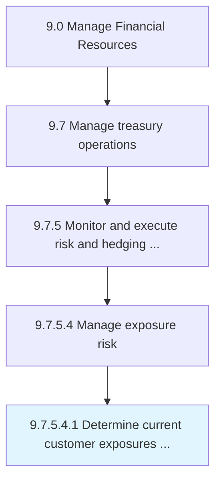

# Determine current customer exposures and limit exceptions

> Establishing ongoing risks that the customers face, and the exceptions to exceeded limits.

## Overview

Sub-Activity 9.7.5.4.1 is an activity within the Manage Financial Resources framework. 

Establishing ongoing risks that the customers face, and the exceptions to exceeded limits.

## Process Hierarchy



## Key Statistics

| Metric | Value |
|--------|-------|
| APQC Code | 19584 |
| Hierarchy ID | 9.7.5.4.1 |
| Level | Sub-Activity |
| Parent | [9.7.5.4](../) |
| Sub-Processes | 0 |


## GraphDL Semantic Structure

```
determine.CurrentCustomerExposuresAndLimitExceptions
```

| Component | Value | Description |
|-----------|-------|-------------|
| Verb | `determine` | Primary action |
| Object | `current customer exposures and limit exceptions` | Direct object |


## Related Concepts

- CurrentCustomerExposuresExceptions
- LimitExceptions


---

*Source: APQC PCF 19584 (9.7.5.4.1) - APQC*
