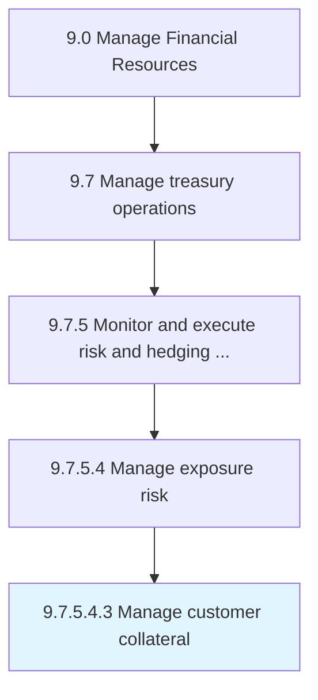

# Manage customer collateral

> Handling customer securities to recover loans that are not paid back.

## Overview

Sub-Activity 9.7.5.4.3 is an activity within the Manage Financial Resources framework. 

Handling customer securities to recover loans that are not paid back.

## Process Hierarchy



## Key Statistics

| Metric | Value |
|--------|-------|
| APQC Code | 19586 |
| Hierarchy ID | 9.7.5.4.3 |
| Level | Sub-Activity |
| Parent | [9.7.5.4](../) |
| Sub-Processes | 0 |


## GraphDL Semantic Structure

```
manage.CustomerCollateral
```

| Component | Value | Description |
|-----------|-------|-------------|
| Verb | `manage` | Primary action |
| Object | `customer collateral` | Direct object |


## Related Concepts

- CustomerCollateral


---

*Source: APQC PCF 19586 (9.7.5.4.3) - APQC*
