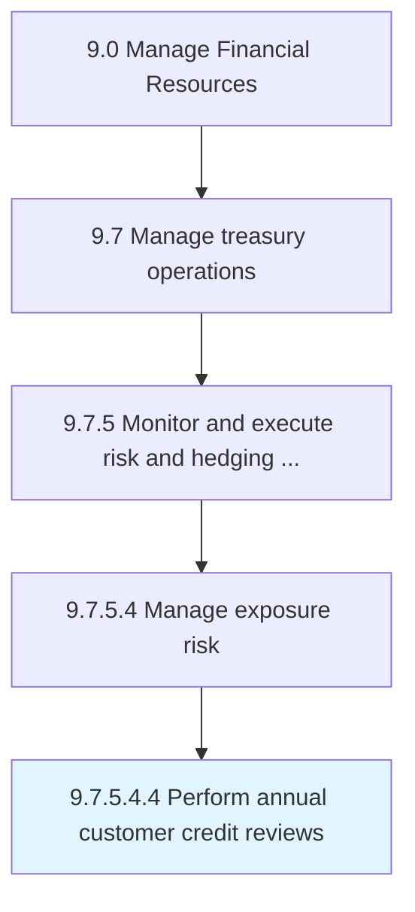

# Perform annual customer credit reviews

> Conducting reviews to assess customer credit on a yearly basis.

## Overview

Sub-Activity 9.7.5.4.4 is an activity within the Manage Financial Resources framework. 

Conducting reviews to assess customer credit on a yearly basis. Introduce changes or make recommendations, if needed.

## Process Hierarchy



## Key Statistics

| Metric | Value |
|--------|-------|
| APQC Code | 19587 |
| Hierarchy ID | 9.7.5.4.4 |
| Level | Sub-Activity |
| Parent | [9.7.5.4](../) |
| Sub-Processes | 0 |


## GraphDL Semantic Structure

```
perform.AnnualCustomerCreditReviews
```

| Component | Value | Description |
|-----------|-------|-------------|
| Verb | `perform` | Primary action |
| Object | `annual customer credit reviews` | Direct object |


## Related Concepts

- [AnnualCustomerCreditReviews](/concepts/AnnualCustomerCreditReviews)


---

*Source: APQC PCF 19587 (9.7.5.4.4) - APQC*
