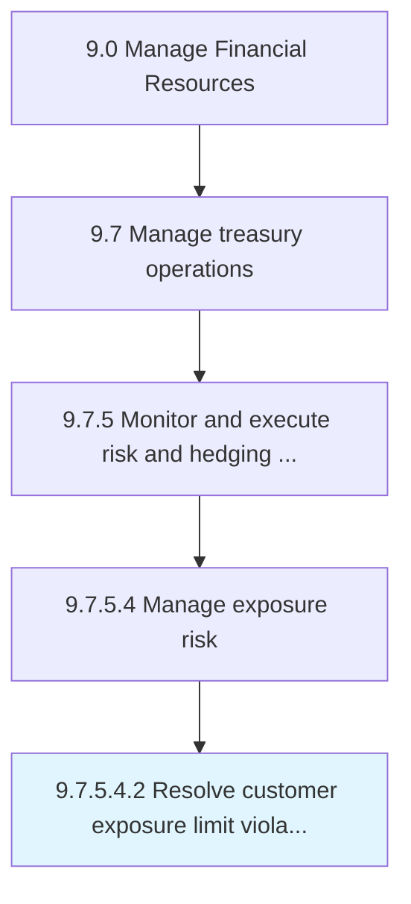

# Resolve customer exposure limit violations

> Settling cases that involve violations of customer exposure limit.

## Overview

Sub-Activity 9.7.5.4.2 is an activity within the Manage Financial Resources framework. 

Settling cases that involve violations of customer exposure limit.

## Process Hierarchy



## Key Statistics

| Metric | Value |
|--------|-------|
| APQC Code | 19585 |
| Hierarchy ID | 9.7.5.4.2 |
| Level | Sub-Activity |
| Parent | [9.7.5.4](../) |
| Sub-Processes | 0 |


## GraphDL Semantic Structure

```
resolve.CustomerExposureLimitViolations
```

| Component | Value | Description |
|-----------|-------|-------------|
| Verb | `resolve` | Primary action |
| Object | `customer exposure limit violations` | Direct object |


## Related Concepts

- CustomerExposureLimitViolations


---

*Source: APQC PCF 19585 (9.7.5.4.2) - APQC*
