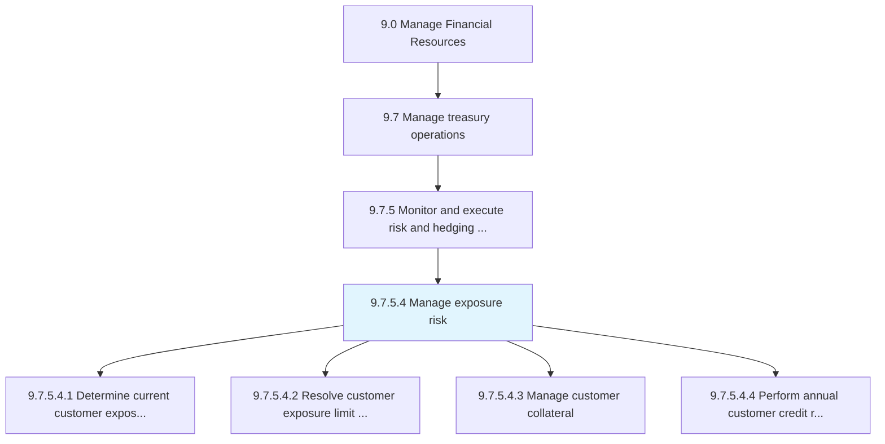
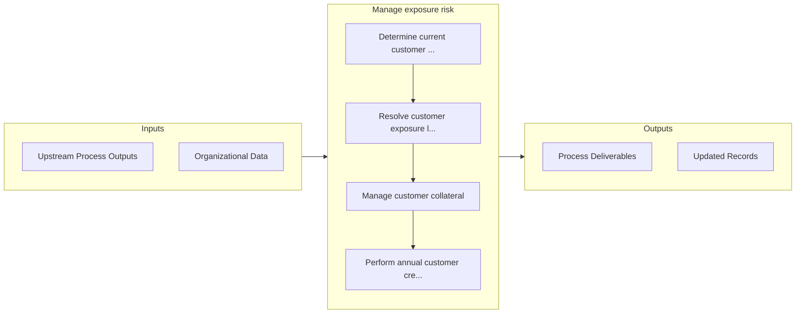

# Manage exposure risk

> Taking care of exposure risks.

## Overview

Activity 9.7.5.4 is an activity within the Manage Financial Resources framework. 

Taking care of exposure risks. Maintain financial investments in particular investments or a portfolios that could be risky for the organization.

## Process Hierarchy



## Key Statistics

| Metric | Value |
|--------|-------|
| APQC Code | 11211 |
| Hierarchy ID | 9.7.5.4 |
| Level | Activity |
| Parent | [9.7.5](../) |
| Sub-Processes | 4 |


## GraphDL Semantic Structure

```
manage.ExposureRisk
```

| Component | Value | Description |
|-----------|-------|-------------|
| Verb | `manage` | Primary action |
| Object | `exposure risk` | Direct object |


## Process Flow



## Sub-Processes

| Process | Hierarchy ID | Description |
|---------|-------------|-------------|
| [Determine current customer exposures and limit exceptions](./DetermineCurrentCustomerExposuresAndLimitExceptions) | 9.7.5.4.1 | Establishing ongoing risks that the customers face, and the exceptions to exceeded limits |
| [Resolve customer exposure limit violations](./ResolveCustomerExposureLimitViolations) | 9.7.5.4.2 | Settling cases that involve violations of customer exposure limit |
| [Manage customer collateral](./ManageCustomerCollateral) | 9.7.5.4.3 | Handling customer securities to recover loans that are not paid back |
| [Perform annual customer credit reviews](./PerformAnnualCustomerCreditReviews) | 9.7.5.4.4 | Conducting reviews to assess customer credit on a yearly basis |


## Related Concepts

- ExposureRisk


---

*Source: APQC PCF 11211 (9.7.5.4) - APQC*
