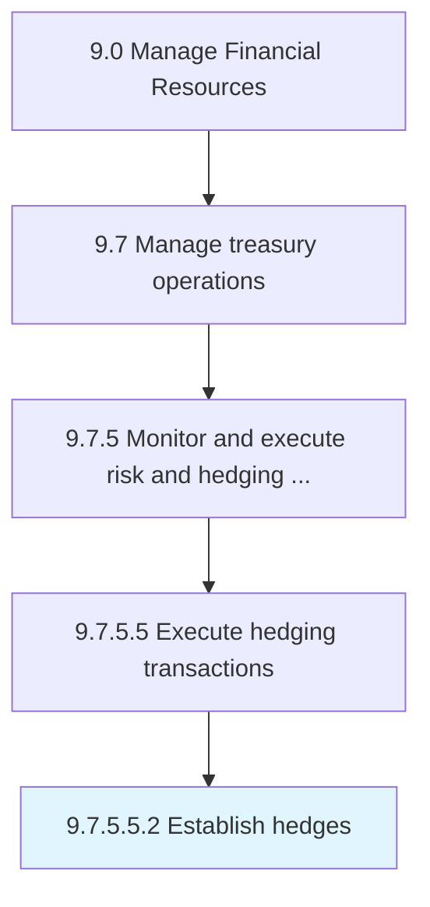

# Establish hedges

> Determining which hedge options to execute.

## Overview

Sub-Activity 9.7.5.5.2 is an activity within the Manage Financial Resources framework. 

## Process Hierarchy



## Key Statistics

| Metric | Value |
|--------|-------|
| APQC Code | 19589 |
| Hierarchy ID | 9.7.5.5.2 |
| Level | Sub-Activity |
| Parent | [9.7.5.5](../) |
| Sub-Processes | 0 |


## GraphDL Semantic Structure

```
establish.Hedges
```

| Component | Value | Description |
|-----------|-------|-------------|
| Verb | `establish` | Primary action |
| Object | `hedges` | Direct object |


## Related Concepts

- [Hedges](/concepts/Hedges)


---

*Source: APQC PCF 19589 (9.7.5.5.2) - APQC*
