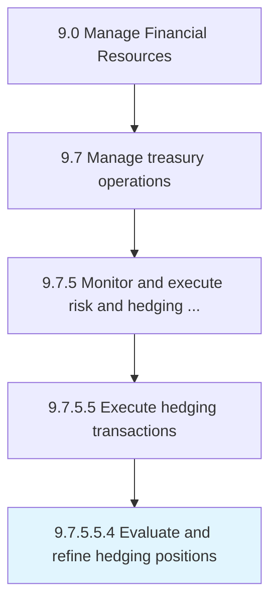

# Evaluate and refine hedging positions

> Examining options in the market for hedging investments.

## Overview

Sub-Activity 9.7.5.5.4 is an activity within the Manage Financial Resources framework. 

Examining options in the market for hedging investments. Select an option.

## Process Hierarchy



## Key Statistics

| Metric | Value |
|--------|-------|
| APQC Code | 11213 |
| Hierarchy ID | 9.7.5.5.4 |
| Level | Sub-Activity |
| Parent | [9.7.5.5](../) |
| Sub-Processes | 0 |


## GraphDL Semantic Structure

```
evaluate.AndRefineHedgingPositions
```

| Component | Value | Description |
|-----------|-------|-------------|
| Verb | `evaluate` | Primary action |
| Object | `and refine hedging positions` | Direct object |


## Related Concepts

- [HedgingPositions](/concepts/HedgingPositions)
- [HedgingPositions](/concepts/HedgingPositions)


---

*Source: APQC PCF 11213 (9.7.5.5.4) - APQC*
