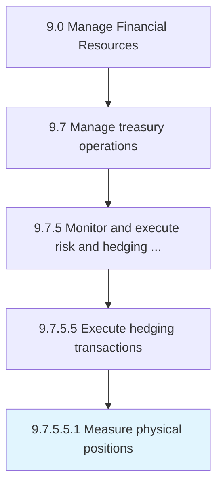

# Measure physical positions

> Evaluating investments made in some market to offset the risks of investing in a contrary or opposing market.

## Overview

Sub-Activity 9.7.5.5.1 is an activity within the Manage Financial Resources framework. 

Evaluating investments made in some market to offset the risks of investing in a contrary or opposing market.

## Process Hierarchy



## Key Statistics

| Metric | Value |
|--------|-------|
| APQC Code | 19588 |
| Hierarchy ID | 9.7.5.5.1 |
| Level | Sub-Activity |
| Parent | [9.7.5.5](../) |
| Sub-Processes | 0 |


## GraphDL Semantic Structure

```
measure.PhysicalPositions
```

| Component | Value | Description |
|-----------|-------|-------------|
| Verb | `measure` | Primary action |
| Object | `physical positions` | Direct object |


## Related Concepts

- [PhysicalPositions](/concepts/PhysicalPositions)


---

*Source: APQC PCF 19588 (9.7.5.5.1) - APQC*
