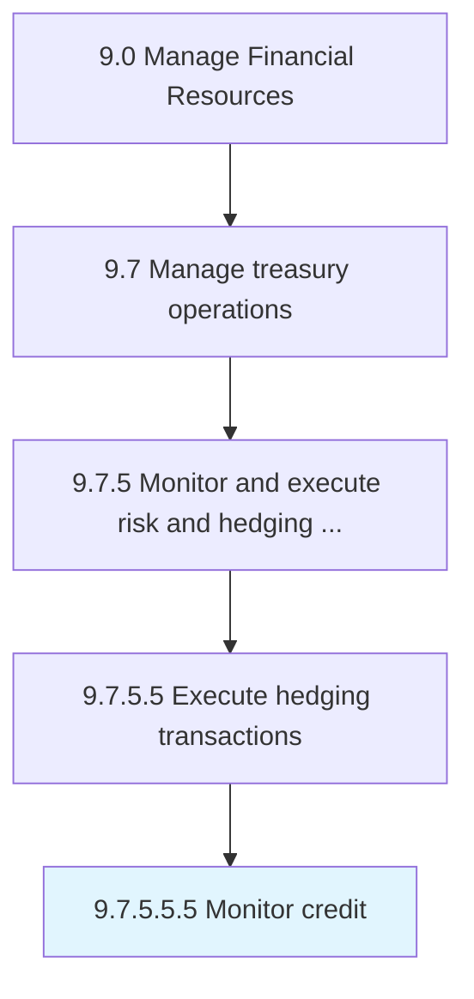

# Monitor credit

> Revising credit reports periodically for accurateness and changes that could be suggestive of duplicitous activity.

## Overview

Sub-Activity 9.7.5.5.5 is an activity within the Manage Financial Resources framework. 

Revising credit reports periodically for accurateness and changes that could be suggestive of duplicitous activity.

## Process Hierarchy



## Key Statistics

| Metric | Value |
|--------|-------|
| APQC Code | 11215 |
| Hierarchy ID | 9.7.5.5.5 |
| Level | Sub-Activity |
| Parent | [9.7.5.5](../) |
| Sub-Processes | 0 |


## GraphDL Semantic Structure

```
monitor.Credit
```

| Component | Value | Description |
|-----------|-------|-------------|
| Verb | `monitor` | Primary action |
| Object | `credit` | Direct object |


## Related Concepts

- [Credit](/concepts/Credit)


---

*Source: APQC PCF 11215 (9.7.5.5.5) - APQC*
