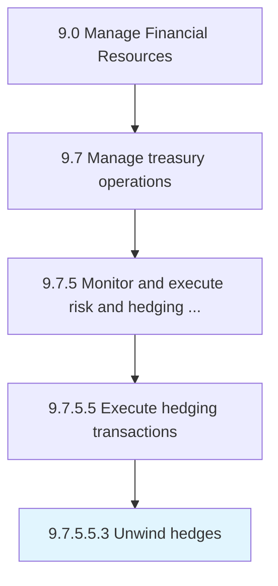

# Unwind hedges

> Closing out a position or cashing in derivatives early.

## Overview

Sub-Activity 9.7.5.5.3 is an activity within the Manage Financial Resources framework. 

Closing out a position or cashing in derivatives early.

## Process Hierarchy



## Key Statistics

| Metric | Value |
|--------|-------|
| APQC Code | 19590 |
| Hierarchy ID | 9.7.5.5.3 |
| Level | Sub-Activity |
| Parent | [9.7.5.5](../) |
| Sub-Processes | 0 |


## GraphDL Semantic Structure

```
unwind.Hedges
```

| Component | Value | Description |
|-----------|-------|-------------|
| Verb | `unwind` | Primary action |
| Object | `hedges` | Direct object |


## Related Concepts

- [Hedges](/concepts/Hedges)


---

*Source: APQC PCF 19590 (9.7.5.5.3) - APQC*
