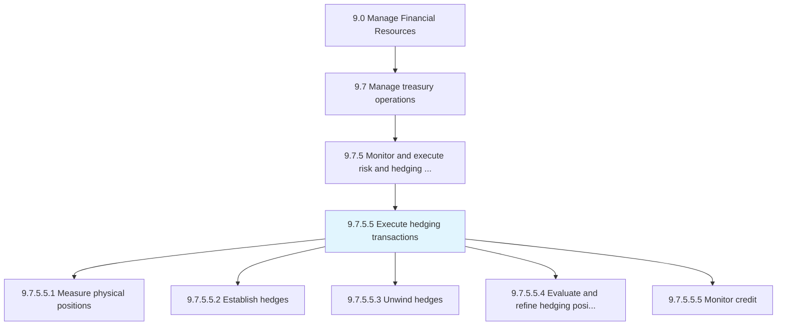
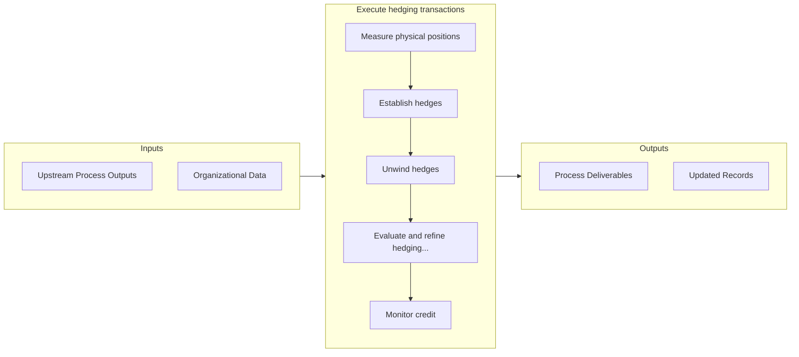
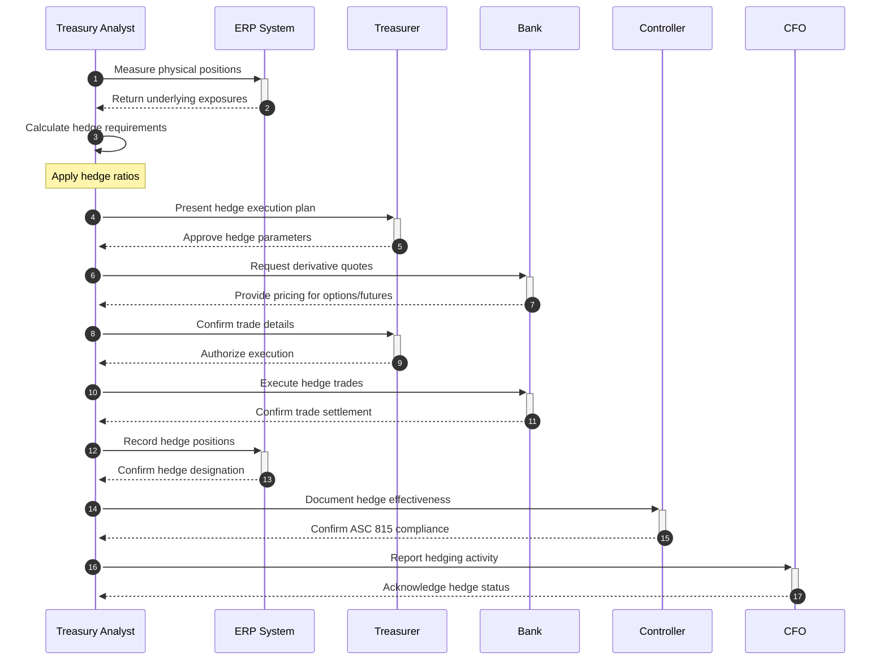

# Execute hedging transactions

> Implementing hedging strategy in attempt to alleviate risk.

## Overview

Activity 9.7.5.5 is an activity within the Manage Financial Resources framework. 

Implementing hedging strategy in attempt to alleviate risk. This will include all options, depravities, and futures contracts agreed upon in Develop risk management/hedging strategy [12974].

## Process Hierarchy



## Key Statistics

| Metric | Value |
|--------|-------|
| APQC Code | 20137 |
| Hierarchy ID | 9.7.5.5 |
| Level | Activity |
| Parent | [9.7.5](../) |
| Sub-Processes | 5 |


## GraphDL Semantic Structure

```graphdl
execute.HedgingTransactions
```

| Component | Value | Description |
|-----------|-------|-------------|
| Verb | `execute` | Primary action |
| Object | `hedging transactions` | Direct object |


## Process Flow



## Sub-Processes

| Process | Hierarchy ID | Description |
|---------|-------------|-------------|
| [Measure physical positions](./MeasurePhysicalPositions) | 9.7.5.5.1 | Evaluating investments made in some market to offset the risks of investing in a contrary or opposin |
| [Establish hedges](./EstablishHedges) | 9.7.5.5.2 | Determining which hedge options to execute |
| [Unwind hedges](./UnwindHedges) | 9.7.5.5.3 | Closing out a position or cashing in derivatives early |
| [Evaluate and refine hedging positions](./EvaluateAndRefineHedgingPositions) | 9.7.5.5.4 | Examining options in the market for hedging investments |
| [Monitor credit](./MonitorCredit) | 9.7.5.5.5 | Revising credit reports periodically for accurateness and changes that could be suggestive of duplic |


## Process Sequence



## Related Concepts

- HedgingTransactions


---

*Source: APQC PCF 20137 (9.7.5.5) - APQC*
