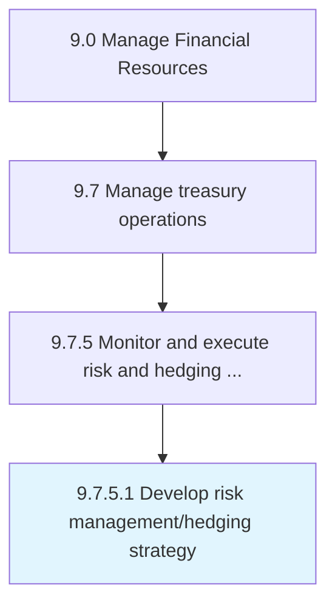

# Develop risk management/hedging strategy

> Taking an investment position to offset exposure to certain risks.

## Overview

Activity 9.7.5.1 is an activity within the Manage Financial Resources framework. 

Taking an investment position to offset exposure to certain risks. This may include purchasing opposite of the organization's position in the marketplace, using derivatives transactions, or futures contracts.

## Process Hierarchy



## Key Statistics

| Metric | Value |
|--------|-------|
| APQC Code | 12974 |
| Hierarchy ID | 9.7.5.1 |
| Level | Activity |
| Parent | [9.7.5](../) |
| Sub-Processes | 0 |


## GraphDL Semantic Structure

```
develop.RiskManagementhedgingStrategy
```

| Component | Value | Description |
|-----------|-------|-------------|
| Verb | `develop` | Primary action |
| Object | `risk management/hedging strategy` | Direct object |


## Related Concepts

- [RiskManagementStrategy](/concepts/RiskManagementStrategy)
- [RiskHedgingStrategy](/concepts/RiskHedgingStrategy)


---

*Source: APQC PCF 12974 (9.7.5.1) - APQC*
