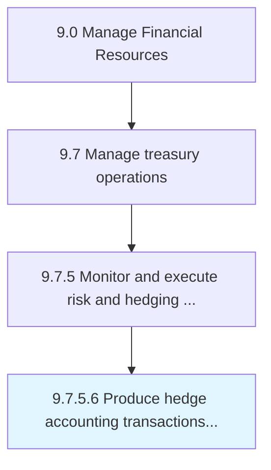

# Produce hedge accounting transactions and reports

> Preparing and documenting accounts and records of all hedging investment transactions to reduce risks due to change in markets.

## Overview

Activity 9.7.5.6 is an activity within the Manage Financial Resources framework. 

Preparing and documenting accounts and records of all hedging investment transactions to reduce risks due to change in markets.

## Process Hierarchy



## Key Statistics

| Metric | Value |
|--------|-------|
| APQC Code | 11214 |
| Hierarchy ID | 9.7.5.6 |
| Level | Activity |
| Parent | [9.7.5](../) |
| Sub-Processes | 0 |


## GraphDL Semantic Structure

```
produce.HedgeAccountingTransactionsAndReports
```

| Component | Value | Description |
|-----------|-------|-------------|
| Verb | `produce` | Primary action |
| Object | `hedge accounting transactions and reports` | Direct object |


## Related Concepts

- [HedgeAccountingTransactions](/concepts/HedgeAccountingTransactions)
- [Reports](/concepts/Reports)


---

*Source: APQC PCF 11214 (9.7.5.6) - APQC*
