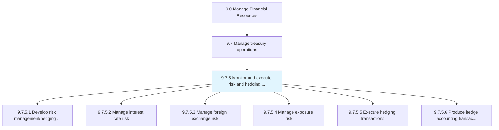
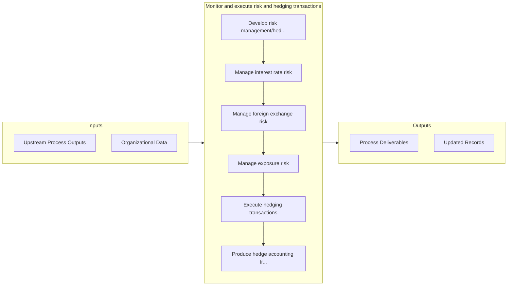

# Monitor and execute risk and hedging transactions

> Performing transactions that limit investment risk with the help of derivatives, such as options and futures contracts.

## Overview

Process 9.7.5 is a core process that defines the specific procedures for monitor and execute risk and hedging transactions. 

Performing transactions that limit investment risk with the help of derivatives, such as options and futures contracts. Manage interest rates, foreign exchange, and exposure risks. Develop and execute hedging transactions. Evaluate and refine hedging positions. Produce hedge accounting transactions and reports. Monitor credit.

## Process Hierarchy



## Key Statistics

| Metric | Value |
|--------|-------|
| APQC Code | 11208 |
| Hierarchy ID | 9.7.5 |
| Level | Process |
| Parent | [9.7](../) |
| Sub-Processes | 6 |


## GraphDL Semantic Structure

```
monitor.AndExecuteRiskAndHedgingTransactions
```

| Component | Value | Description |
|-----------|-------|-------------|
| Verb | `monitor` | Primary action |
| Object | `and execute risk and hedging transactions` | Direct object |


## Process Flow



## Sub-Processes

| Process | Hierarchy ID | Description |
|---------|-------------|-------------|
| [Develop risk management/hedging strategy](./DevelopRiskManagementhedgingStrategy) | 9.7.5.1 | Taking an investment position to offset exposure to certain risks |
| [Manage interest rate risk](./9.7.5.2-ManageInterestRateRisk/) | 9.7.5.2 | Handling risks arising from changes in the interest rate |
| [Manage foreign exchange risk](./9.7.5.3-ManageForeignExchangeRisk/) | 9.7.5.3 | Taking care of foreign-exchange risks |
| [Manage exposure risk](./9.7.5.4-ManageExposureRisk/) | 9.7.5.4 | Taking care of exposure risks |
| [Execute hedging transactions](./9.7.5.5-ExecuteHedgingTransactions/) | 9.7.5.5 | Implementing hedging strategy in attempt to alleviate risk |
| [Produce hedge accounting transactions and reports](./ProduceHedgeAccountingTransactionsAndReports) | 9.7.5.6 | Preparing and documenting accounts and records of all hedging investment transactions to reduce risk |


## Related Concepts

- RiskTransactions
- HedgingTransactions
- RiskTransactions
- HedgingTransactions


---

*Source: APQC PCF 11208 (9.7.5) - APQC*
