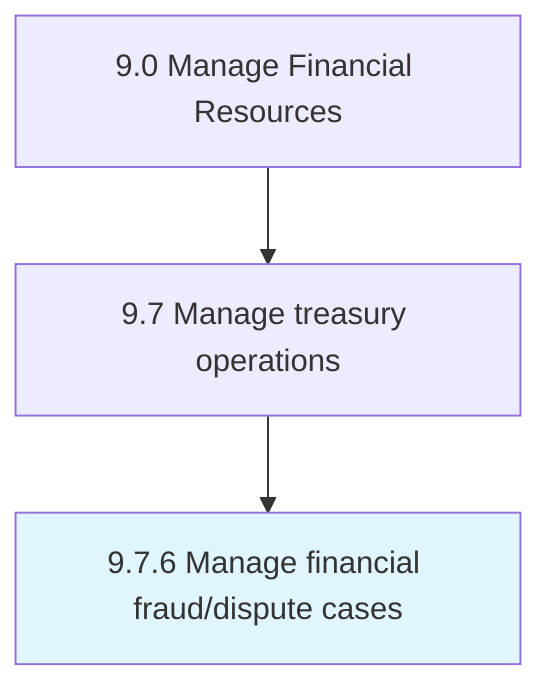

# Manage financial fraud/dispute cases

> Handling cases that involve financial fraud.

## Overview

Process 9.7.6 is a core process that defines the specific procedures for manage financial fraud/dispute cases. 

Handling cases that involve financial fraud. Resolve disputes.

## Process Hierarchy



## Key Statistics

| Metric | Value |
|--------|-------|
| APQC Code | 16958 |
| Hierarchy ID | 9.7.6 |
| Level | Process |
| Parent | [9.7](../) |
| Sub-Processes | 0 |


## GraphDL Semantic Structure

```
manage.FinancialFrauddisputeCases
```

| Component | Value | Description |
|-----------|-------|-------------|
| Verb | `manage` | Primary action |
| Object | `financial fraud/dispute cases` | Direct object |


## Related Concepts

- [FinancialFraudCases](/concepts/FinancialFraudCases)
- [FinancialDisputeCases](/concepts/FinancialDisputeCases)


---

*Source: APQC PCF 16958 (9.7.6) - APQC*
