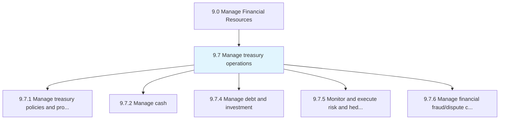
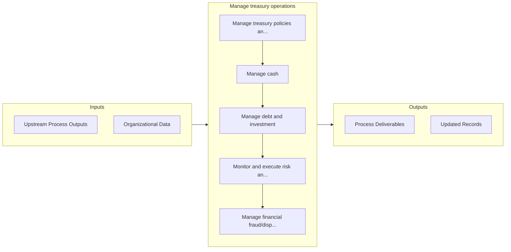

# Manage treasury operations

> Managing business's investments in trading in bonds, currencies, financial derivatives, etc.

## Overview

Group 9.7 is a process group within APQC Category 9.0 (Manage Financial Resources). 

Managing business's investments in trading in bonds, currencies, financial derivatives, etc. Manage the financial assets and holdings of the organization. Optimize the organization's liquidity. Invest excess cash. Reduce financial risks.

## Process Hierarchy



## Key Statistics

| Metric | Value |
|--------|-------|
| APQC Code | 10734 |
| Hierarchy ID | 9.7 |
| Level | Group |
| Parent | [9](../) |
| Sub-Processes | 5 |


## GraphDL Semantic Structure

```
manage.TreasuryOperations
```

| Component | Value | Description |
|-----------|-------|-------------|
| Verb | `manage` | Primary action |
| Object | `treasury operations` | Direct object |


## Process Flow



## Sub-Processes

| Process | Hierarchy ID | Description |
|---------|-------------|-------------|
| [Manage treasury policies and procedures](./9.7.1-ManageTreasuryPoliciesProcedures/) | 9.7.1 | Managing rules and regulations for investments in trading in bonds, currencies, financial derivative |
| [Manage cash](./9.7.2-ManageCash/) | 9.7.2 | Taking care of all cash-related activities in the business |
| [Manage debt and investment](./9.7.4-ManageDebtInvestment/) | 9.7.4 | Taking care of the organization's financial position |
| [Monitor and execute risk and hedging transactions](./9.7.5-MonitorExecuteRiskHedging/) | 9.7.5 | Performing transactions that limit investment risk with the help of derivatives, such as options and |
| [Manage financial fraud/dispute cases](./ManageFinancialFrauddisputeCases) | 9.7.6 | Handling cases that involve financial fraud |


## Related Concepts

- TreasuryOperations


---

*Source: APQC PCF 10734 (9.7) - APQC*
