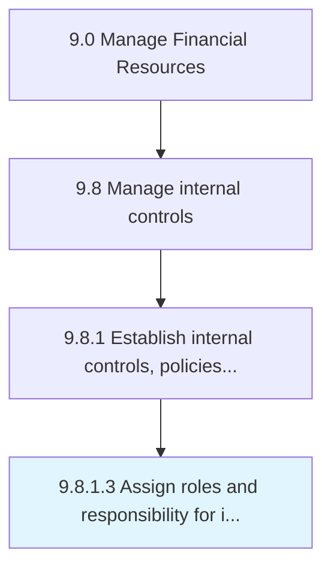

# Assign roles and responsibility for internal controls

> Defining roles, responsibilities, and accountabilities for effectiveness and proficiency of operations and reliability of financial reporting.

## Overview

Activity 9.8.1.3 is an activity within the Manage Financial Resources framework. 

Defining roles, responsibilities, and accountabilities for effectiveness and proficiency of operations and reliability of financial reporting.

## Process Hierarchy



## Key Statistics

| Metric | Value |
|--------|-------|
| APQC Code | 10916 |
| Hierarchy ID | 9.8.1.3 |
| Level | Activity |
| Parent | [9.8.1](../) |
| Sub-Processes | 0 |


## GraphDL Semantic Structure

```
assign.RolesAndResponsibility.for.InternalControls
```

| Component | Value | Description |
|-----------|-------|-------------|
| Verb | `assign` | Primary action |
| Object | `roles and responsibility` | Direct object |
| Preposition | `for` | Relationship |
| PrepObject | `internal controls` | Indirect object |


## Related Concepts

- Roles
- InternalControls
- Responsibility
- InternalControls


---

*Source: APQC PCF 10916 (9.8.1.3) - APQC*
