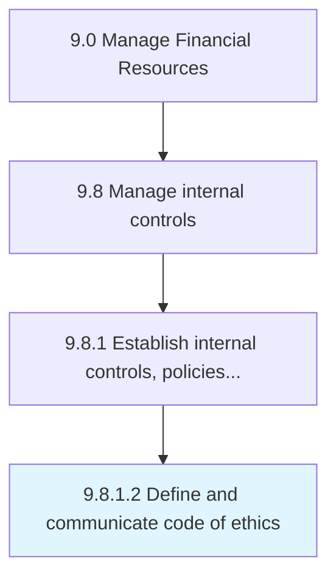

# Define and communicate code of ethics

> Outlining and communicating a code of ethics act responsibly.

## Overview

Activity 9.8.1.2 is an activity within the Manage Financial Resources framework. 

Outlining and communicating a code of ethics act responsibly.

## Process Hierarchy



## Key Statistics

| Metric | Value |
|--------|-------|
| APQC Code | 10915 |
| Hierarchy ID | 9.8.1.2 |
| Level | Activity |
| Parent | [9.8.1](../) |
| Sub-Processes | 0 |


## GraphDL Semantic Structure

```
define.AndCommunicateCode.of.Ethics
```

| Component | Value | Description |
|-----------|-------|-------------|
| Verb | `define` | Primary action |
| Object | `and communicate code` | Direct object |
| Preposition | `of` | Relationship |
| PrepObject | `ethics` | Indirect object |


## Related Concepts

- Code
- Ethics
- Code
- Ethics


---

*Source: APQC PCF 10915 (9.8.1.2) - APQC*
