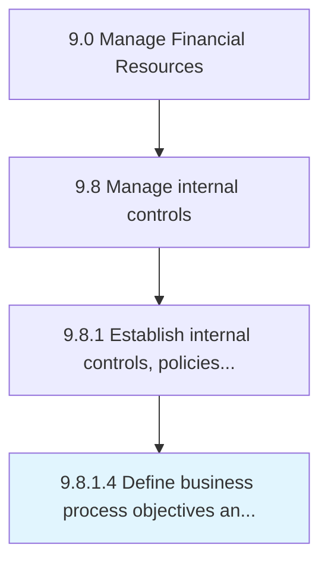

# Define business process objectives and risks

> Outlining the objectives and risks associated with a process.

## Overview

Activity 9.8.1.4 is an activity within the Manage Financial Resources framework. 

Outlining the objectives and risks associated with a process. Delineate process goals. Determine the risks attached to it. Determine what the process is meant to accomplish, potential issues, a timeline of potential risks, the scope and potential impact of risks, etc.

## Process Hierarchy



## Key Statistics

| Metric | Value |
|--------|-------|
| APQC Code | 11250 |
| Hierarchy ID | 9.8.1.4 |
| Level | Activity |
| Parent | [9.8.1](../) |
| Sub-Processes | 0 |


## GraphDL Semantic Structure

```
define.BusinessProcessObjectivesAndRisks
```

| Component | Value | Description |
|-----------|-------|-------------|
| Verb | `define` | Primary action |
| Object | `business process objectives and risks` | Direct object |


## Related Concepts

- BusinessProcessObjectives
- Risks


---

*Source: APQC PCF 11250 (9.8.1.4) - APQC*
