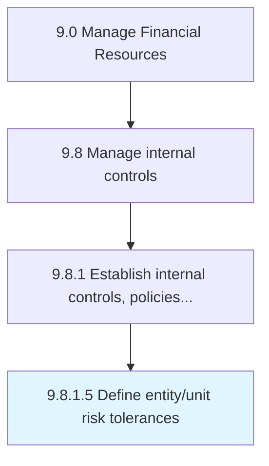

# Define entity/unit risk tolerances

> Outlining the risk tolerance levels of individual units, as well as the organization as a whole.

## Overview

Activity 9.8.1.5 is an activity within the Manage Financial Resources framework. 

Outlining the risk tolerance levels of individual units, as well as the organization as a whole. Determine the specific maximum risk to take in quantitative terms for each relevant risk subcategory, including strategic, operational, financial, and compliance risks.

## Process Hierarchy



## Key Statistics

| Metric | Value |
|--------|-------|
| APQC Code | 11251 |
| Hierarchy ID | 9.8.1.5 |
| Level | Activity |
| Parent | [9.8.1](../) |
| Sub-Processes | 0 |


## GraphDL Semantic Structure

```
define.EntityunitRiskTolerances
```

| Component | Value | Description |
|-----------|-------|-------------|
| Verb | `define` | Primary action |
| Object | `entity/unit risk tolerances` | Direct object |


## Related Concepts

- [EntityRiskTolerances](/concepts/EntityRiskTolerances)
- [UnitRiskTolerances](/concepts/UnitRiskTolerances)


---

*Source: APQC PCF 11251 (9.8.1.5) - APQC*
