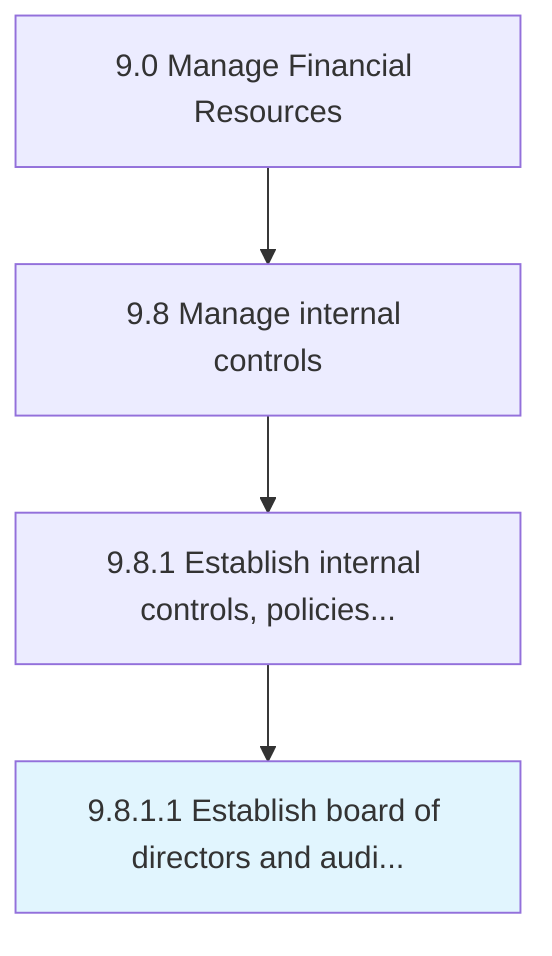
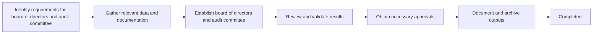

# Establish board of directors and audit committee

> Establishing board of directors and auditing committee in order to assign roles and responsibilities for internal controls.

## Overview

Activity 9.8.1.1 is an activity within the Internal Controls domain of the Manage Financial Resources framework.

Establishing board of directors and auditing committee in order to assign roles and responsibilities for internal controls. This activity plays a critical role in ensuring that the organization maintains sound financial governance, operational efficiency, and regulatory compliance. It supports upstream planning and downstream execution by providing structured outputs that inform decision-making across finance and business operations. Effective execution of this activity requires coordination among finance professionals, process owners, and leadership stakeholders to ensure accuracy, timeliness, and alignment with organizational objectives.

## Process Hierarchy



## Process Flow



## Key Statistics

| Metric | Value |
|--------|-------|
| APQC Code | 10914 |
| Hierarchy ID | 9.8.1.1 |
| Level | Activity |
| Parent | [9.8.1](../) |
| Sub-Processes | 0 |

## GraphDL Semantic Structure

```
establish.Board.of.DirectorsAndAuditCommittee
```

| Component | Value | Description |
|-----------|-------|-------------|
| Verb | `establish` | Primary action |
| Object | `board` | Direct object |
| Preposition | `of` | Relationship |
| PrepObject | `directors and audit committee` | Indirect object |

## RACI Matrix

| Activity | Responsible | Accountable | Consulted | Informed |
|----------|-------------|-------------|-----------|----------|
| Design controls | Internal Audit Manager | Chief Audit Executive | Process Owners | Audit Committee |
| Test control effectiveness | Internal Auditor | Internal Audit Manager | Control Owners | CFO |
| Remediate deficiencies | Process Owner | Controller | Internal Audit | Audit Committee |

## Related Occupations

- [Financial Managers](/occupations/FinancialManagers)
- [Accountants and Auditors](/occupations/AccountantsAndAuditors)
- [Compliance Officers](/occupations/ComplianceOfficers)
- [Internal Auditors](/occupations/AccountantsAndAuditors)
- [Financial Examiners](/occupations/FinancialExaminers)

## Related Departments

- Internal Audit
- Compliance
- Finance & Accounting

## Industry Variations

### Banking

Internal controls address SOX compliance, anti-money laundering, and operational risk management with three lines of defense.

### Healthcare

Controls encompass HIPAA compliance, billing integrity, and clinical documentation improvement programs.

### Manufacturing

Focuses on inventory controls, cost accounting accuracy, and supply chain financial integrity.

## KPIs & Metrics

| Metric | Description | Target |
|--------|-------------|--------|
| Control Deficiency Rate | Number of control deficiencies identified | 0 material weaknesses |
| Audit Finding Resolution Time | Days to remediate audit findings | < 30 days |
| SOX Compliance Rate | Percentage of controls tested as effective | > 98% |
| Policy Exception Rate | Percentage of transactions with policy exceptions | < 2% |

## Related Concepts

- Board
- Directors
- Board
- AuditCommittee

---

*Source: APQC PCF 10914 (9.8.1.1) - APQC*