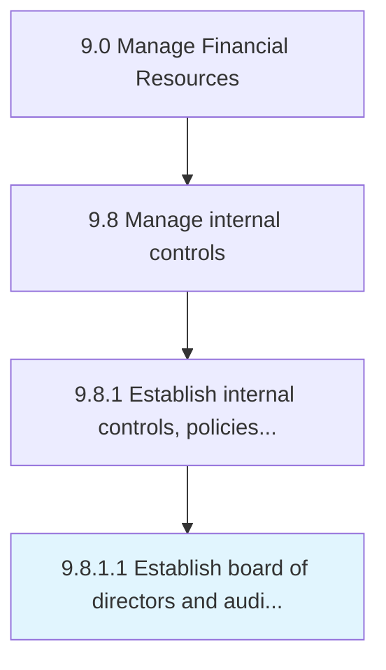

# Establish board of directors and audit committee

> Establishing board of directors and auditing committee in order to assign roles and responsibilities for internal controls.

## Overview

Activity 9.8.1.1 is an activity within the Manage Financial Resources framework. 

Establishing board of directors and auditing committee in order to assign roles and responsibilities for internal controls.

## Process Hierarchy



## Key Statistics

| Metric | Value |
|--------|-------|
| APQC Code | 10914 |
| Hierarchy ID | 9.8.1.1 |
| Level | Activity |
| Parent | [9.8.1](../) |
| Sub-Processes | 0 |


## GraphDL Semantic Structure

```
establish.Board.of.DirectorsAndAuditCommittee
```

| Component | Value | Description |
|-----------|-------|-------------|
| Verb | `establish` | Primary action |
| Object | `board` | Direct object |
| Preposition | `of` | Relationship |
| PrepObject | `directors and audit committee` | Indirect object |


## Related Concepts

- [Board](/concepts/Board)
- [Directors](/concepts/Directors)
- [Board](/concepts/Board)
- [AuditCommittee](/concepts/AuditCommittee)


---

*Source: APQC PCF 10914 (9.8.1.1) - APQC*
