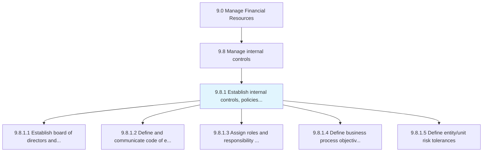
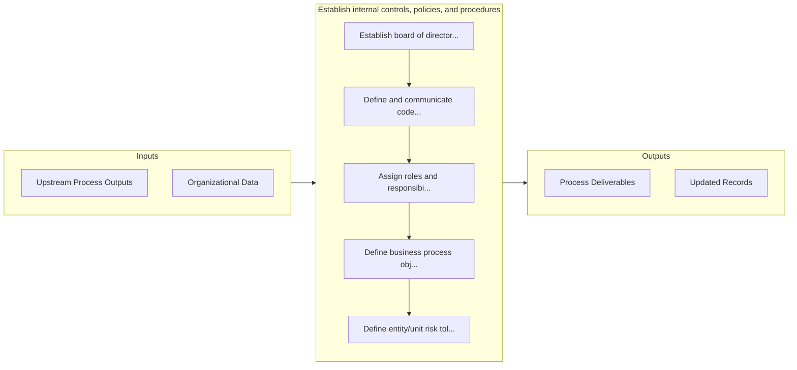

# Establish internal controls, policies, and procedures

> Forming rules and regulations to ensure the achievement of effectiveness, proficiency of operations, and reliability of financial reporting.

## Overview

Process 9.8.1 is a core process that defines the specific procedures for establish internal controls, policies, and procedures. 

Forming rules and regulations to ensure the achievement of effectiveness, proficiency of operations, and reliability of financial reporting.

## Process Hierarchy



## Key Statistics

| Metric | Value |
|--------|-------|
| APQC Code | 10762 |
| Hierarchy ID | 9.8.1 |
| Level | Process |
| Parent | [9.8](../) |
| Sub-Processes | 5 |


## GraphDL Semantic Structure

```
establish.InternalControlsPoliciesAndProcedures
```

| Component | Value | Description |
|-----------|-------|-------------|
| Verb | `establish` | Primary action |
| Object | `internal controls, policies, and procedures` | Direct object |


## Process Flow



## Sub-Processes

| Process | Hierarchy ID | Description |
|---------|-------------|-------------|
| [Establish board of directors and audit committee](./EstablishBoardOfDirectorsAndAuditCommittee) | 9.8.1.1 | Establishing board of directors and auditing committee in order to assign roles and responsibilities |
| [Define and communicate code of ethics](./DefineAndCommunicateCodeOfEthics) | 9.8.1.2 | Outlining and communicating a code of ethics act responsibly |
| [Assign roles and responsibility for internal controls](./AssignRolesAndResponsibilityForInternalControls) | 9.8.1.3 | Defining roles, responsibilities, and accountabilities for effectiveness and proficiency of operatio |
| [Define business process objectives and risks](./DefineBusinessProcessObjectivesAndRisks) | 9.8.1.4 | Outlining the objectives and risks associated with a process |
| [Define entity/unit risk tolerances](./DefineEntityunitRiskTolerances) | 9.8.1.5 | Outlining the risk tolerance levels of individual units, as well as the organization as a whole |


## Related Concepts

- InternalControls
- Policies
- Procedures


---

*Source: APQC PCF 10762 (9.8.1) - APQC*
