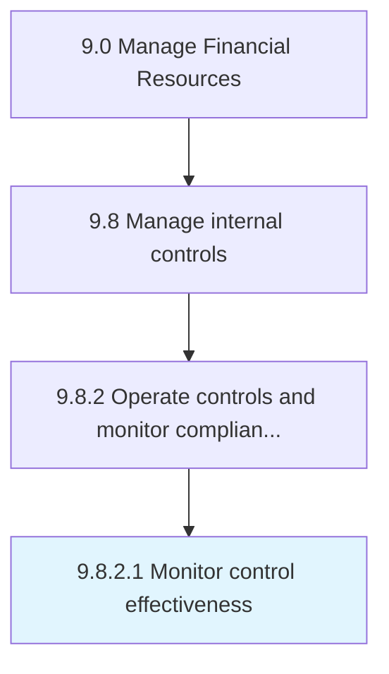

# Monitor control effectiveness

> Overseeing the activities for internal controls.

## Overview

Activity 9.8.2.1 is an activity within the Manage Financial Resources framework. 

Overseeing the activities for internal controls. Observe the effectiveness of policies, procedures, techniques, and mechanisms actions taken to minimize risk.

## Process Hierarchy



## Key Statistics

| Metric | Value |
|--------|-------|
| APQC Code | 10918 |
| Hierarchy ID | 9.8.2.1 |
| Level | Activity |
| Parent | [9.8.2](../) |
| Sub-Processes | 0 |


## GraphDL Semantic Structure

```
monitor.ControlEffectiveness
```

| Component | Value | Description |
|-----------|-------|-------------|
| Verb | `monitor` | Primary action |
| Object | `control effectiveness` | Direct object |


## Related Concepts

- [ControlEffectiveness](/concepts/ControlEffectiveness)


---

*Source: APQC PCF 10918 (9.8.2.1) - APQC*
