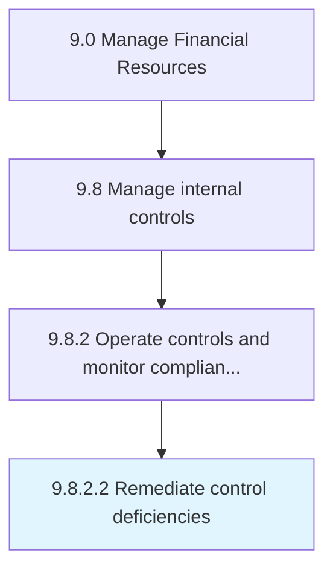

# Remediate control deficiencies

> Taking corrective measures for policies, procedures, techniques, and mechanisms actions taken to minimize risk.

## Overview

Activity 9.8.2.2 is an activity within the Manage Financial Resources framework. 

Taking corrective measures for policies, procedures, techniques, and mechanisms actions taken to minimize risk. (Conduct in accordance with Monitor control effectiveness [10918] in order to determine and rectify the control deficiencies.)

## Process Hierarchy



## Key Statistics

| Metric | Value |
|--------|-------|
| APQC Code | 10919 |
| Hierarchy ID | 9.8.2.2 |
| Level | Activity |
| Parent | [9.8.2](../) |
| Sub-Processes | 0 |


## GraphDL Semantic Structure

```
remediate.ControlDeficiencies
```

| Component | Value | Description |
|-----------|-------|-------------|
| Verb | `remediate` | Primary action |
| Object | `control deficiencies` | Direct object |


## Related Concepts

- ControlDeficiencies


---

*Source: APQC PCF 10919 (9.8.2.2) - APQC*
