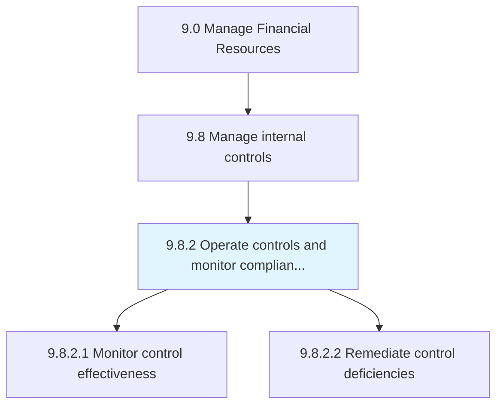
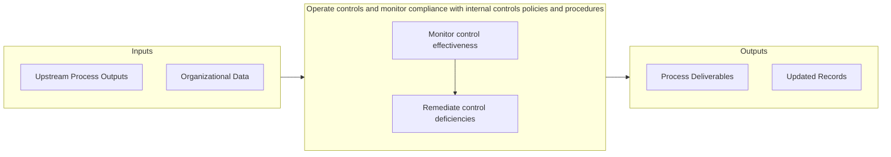

# Operate controls and monitor compliance with internal controls policies and procedures

> Performing planning, management, operations, and monitoring of internal control mechanism policies and procedures in order to manage internal controls.

## Overview

Process 9.8.2 is a core process that defines the specific procedures for operate controls and monitor compliance with internal controls policies and procedures. 

Performing planning, management, operations, and monitoring of internal control mechanism policies and procedures in order to manage internal controls.

## Process Hierarchy



## Key Statistics

| Metric | Value |
|--------|-------|
| APQC Code | 21574 |
| Hierarchy ID | 9.8.2 |
| Level | Process |
| Parent | [9.8](../) |
| Sub-Processes | 2 |


## Process Overview

Finance processes manage financial planning, accounting, treasury, and controls to ensure financial health. This process focuses on operate controls and monitor compliance with internal controls policies and procedures, which is essential for organizational effectiveness and achieving business objectives.

## Key Metrics

| Metric | Description | Target |
|--------|-------------|--------|
| Days sales outstanding | Measure of days sales outstanding | Target varies by organization |
| Budget variance | Measure of budget variance | Target varies by organization |
| Cash conversion cycle | Measure of cash conversion cycle | Target varies by organization |
| Cost per transaction | Measure of cost per transaction | Target varies by organization |

## Related Departments

- [Finance](/departments/Finance)
- [Accounting](/departments/Accounting)
- [Treasury](/departments/Treasury)

## Related Occupations

- [Financial Managers](/occupations/Management/FinancialManagers)
- [Accountants](/occupations/Business/AccountantsAndAuditors)
- [Financial Analysts](/occupations/Business/FinancialAnalysts)

## RACI Matrix

| Activity | Responsible | Accountable | Consulted | Informed |
|----------|-------------|-------------|-----------|----------|
| Plan | Process Owner | Manager | Stakeholders | Team |
| Execute | Team | Process Owner | Manager | Stakeholders |
| Monitor | Analyst | Manager | Process Owner | Leadership |
| Improve | Process Owner | Manager | Team | Stakeholders |

## GraphDL Semantic Structure

```graphdl
operate.ControlsAndMonitorCompliance.with.InternalControlsPoliciesAndProcedures
```

| Component | Value | Description |
|-----------|-------|-------------|
| Verb | `operate` | Primary action |
| Object | `controls and monitor compliance` | Direct object |
| Preposition | `with` | Relationship |
| PrepObject | `internal controls policies and procedures` | Indirect object |


## Process Flow



## Sub-Processes

| Process | Hierarchy ID | Description |
|---------|-------------|-------------|
| [Monitor control effectiveness](./MonitorControlEffectiveness) | 9.8.2.1 | Overseeing the activities for internal controls |
| [Remediate control deficiencies](./RemediateControlDeficiencies) | 9.8.2.2 | Taking corrective measures for policies, procedures, techniques, and mechanisms actions taken to min |


## Related Concepts

- ControlsCompliance
- InternalControlsPolicies
- ControlsCompliance
- Procedures
- MonitorCompliance
- InternalControlsPolicies
- MonitorCompliance
- Procedures


---

*Source: APQC PCF 21574 (9.8.2) - APQC*
