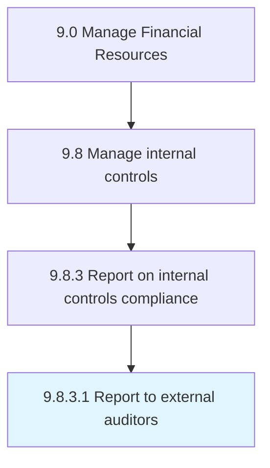

# Report to external auditors

> Reporting to external auditors.

## Overview

Activity 9.8.3.1 is an activity within the Manage Financial Resources framework. 

Reporting to external auditors. This process requires the organization to report to external auditors about the regulations for any critical data that the organization is holding.

## Process Hierarchy



## Key Statistics

| Metric | Value |
|--------|-------|
| APQC Code | 10923 |
| Hierarchy ID | 9.8.3.1 |
| Level | Activity |
| Parent | [9.8.3](../) |
| Sub-Processes | 0 |


## GraphDL Semantic Structure

```
report.ToExternalAuditors
```

| Component | Value | Description |
|-----------|-------|-------------|
| Verb | `report` | Primary action |
| Object | `to external auditors` | Direct object |


## Related Concepts

- [ExternalAuditors](/concepts/ExternalAuditors)


---

*Source: APQC PCF 10923 (9.8.3.1) - APQC*
