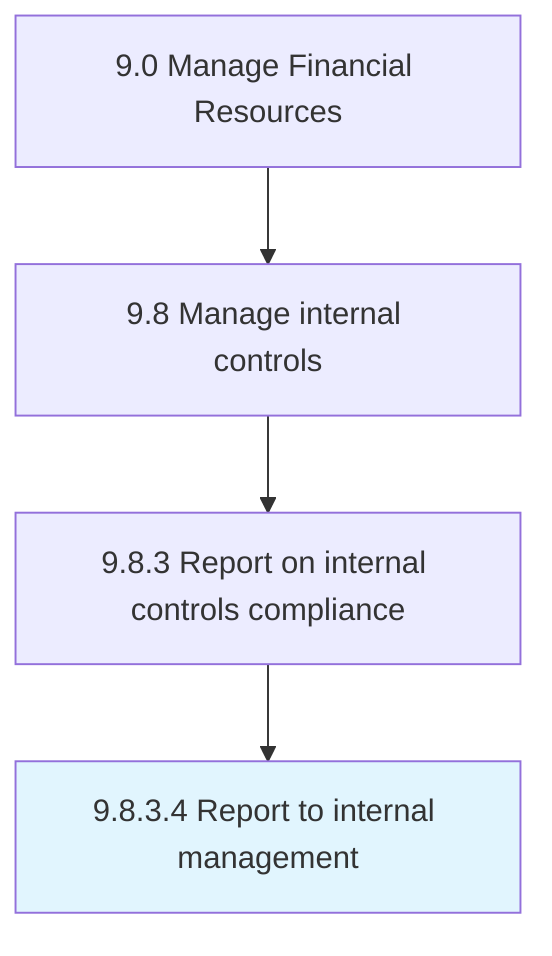

# Report to internal management

> Reporting to internal management (all employees, directors, and management) about IT regulations and pertinent data.

## Overview

Activity 9.8.3.4 is an activity within the Manage Financial Resources framework. 

Reporting to internal management (all employees, directors, and management) about IT regulations and pertinent data.

## Process Hierarchy



## Key Statistics

| Metric | Value |
|--------|-------|
| APQC Code | 10926 |
| Hierarchy ID | 9.8.3.4 |
| Level | Activity |
| Parent | [9.8.3](../) |
| Sub-Processes | 0 |


## GraphDL Semantic Structure

```
report.ToInternalManagement
```

| Component | Value | Description |
|-----------|-------|-------------|
| Verb | `report` | Primary action |
| Object | `to internal management` | Direct object |


## Related Concepts

- InternalManagement


---

*Source: APQC PCF 10926 (9.8.3.4) - APQC*
