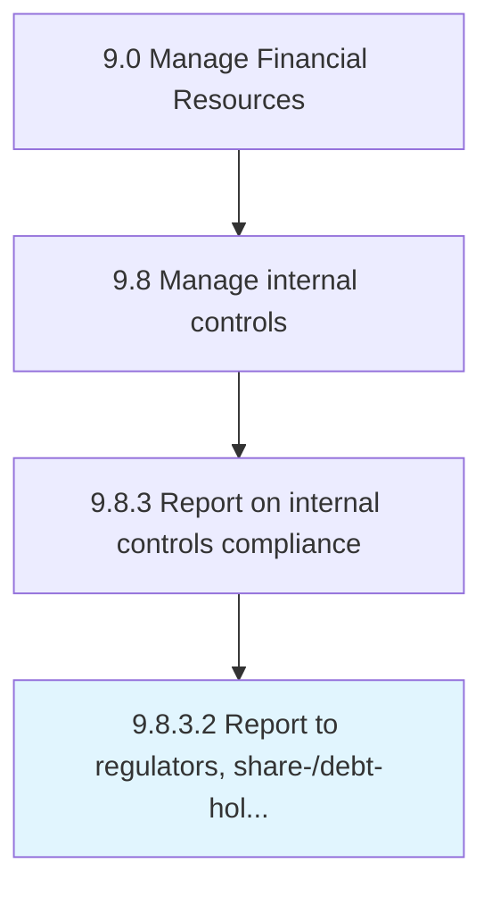

# Report to regulators, share-/debt-holders, securities exchanges, etc.

> Reporting to regulators, shareholders, debt holders, securities exchanges, etc.

## Overview

Activity 9.8.3.2 is an activity within the Manage Financial Resources framework. 

Reporting to regulators, shareholders, debt holders, securities exchanges, etc. about IT regulations and pertinent data.

## Process Hierarchy



## Key Statistics

| Metric | Value |
|--------|-------|
| APQC Code | 10924 |
| Hierarchy ID | 9.8.3.2 |
| Level | Activity |
| Parent | [9.8.3](../) |
| Sub-Processes | 0 |


## GraphDL Semantic Structure

```
report.ToRegulatorsSharedebtholdersSecuritiesExchangesEtc
```

| Component | Value | Description |
|-----------|-------|-------------|
| Verb | `report` | Primary action |
| Object | `to regulators, share-/debt-holders, securities exchanges, etc.` | Direct object |


---

*Source: APQC PCF 10924 (9.8.3.2) - APQC*
