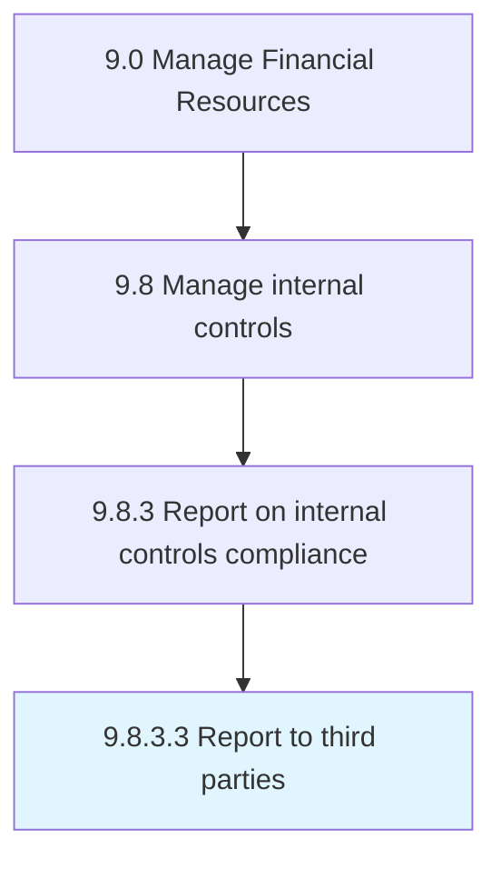

# Report to third parties

> Reporting to suppliers, customers, and partners that are doing business with the company about IT regulations and pertinent data.

## Overview

Activity 9.8.3.3 is an activity within the Manage Financial Resources framework. 

Reporting to suppliers, customers, and partners that are doing business with the company about IT regulations and pertinent data.

## Process Hierarchy



## Key Statistics

| Metric | Value |
|--------|-------|
| APQC Code | 10925 |
| Hierarchy ID | 9.8.3.3 |
| Level | Activity |
| Parent | [9.8.3](../) |
| Sub-Processes | 0 |


## GraphDL Semantic Structure

```
report.ToThirdParties
```

| Component | Value | Description |
|-----------|-------|-------------|
| Verb | `report` | Primary action |
| Object | `to third parties` | Direct object |


## Related Concepts

- [ThirdParties](/concepts/ThirdParties)


---

*Source: APQC PCF 10925 (9.8.3.3) - APQC*
