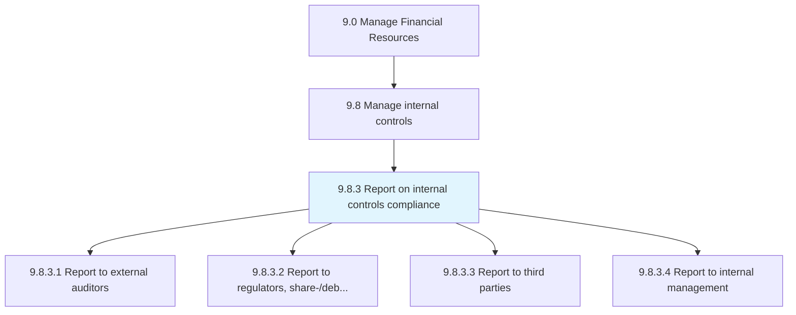
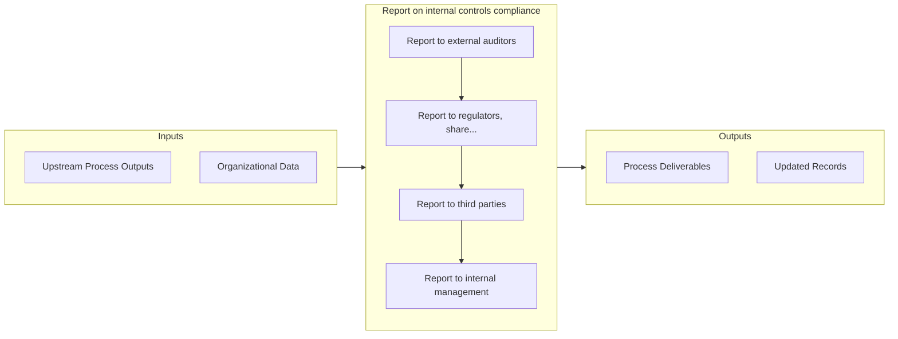

# Report on internal controls compliance

> Reporting on internal controls compliance to the appropriate authority, including IT regulations and pertinent data.

## Overview

Process 9.8.3 is a core process that defines the specific procedures for report on internal controls compliance. 

Reporting on internal controls compliance to the appropriate authority, including IT regulations and pertinent data.

## Process Hierarchy



## Key Statistics

| Metric | Value |
|--------|-------|
| APQC Code | 10764 |
| Hierarchy ID | 9.8.3 |
| Level | Process |
| Parent | [9.8](../) |
| Sub-Processes | 4 |


## GraphDL Semantic Structure

```
report.OnInternalControlsCompliance
```

| Component | Value | Description |
|-----------|-------|-------------|
| Verb | `report` | Primary action |
| Object | `on internal controls compliance` | Direct object |


## Process Flow



## Sub-Processes

| Process | Hierarchy ID | Description |
|---------|-------------|-------------|
| [Report to external auditors](./ReportToExternalAuditors) | 9.8.3.1 | Reporting to external auditors |
| [Report to regulators, share-/debt-holders, securities exchanges, etc.](./ReportToRegulatorsSharedebtholdersSecuritiesExchangesEtc) | 9.8.3.2 | Reporting to regulators, shareholders, debt holders, securities exchanges, etc |
| [Report to third parties](./ReportToThirdParties) | 9.8.3.3 | Reporting to suppliers, customers, and partners that are doing business with the company about IT re |
| [Report to internal management](./ReportToInternalManagement) | 9.8.3.4 | Reporting to internal management (all employees, directors, and management) about IT regulations and |


## Related Concepts

- InternalControlsCompliance


---

*Source: APQC PCF 10764 (9.8.3) - APQC*
