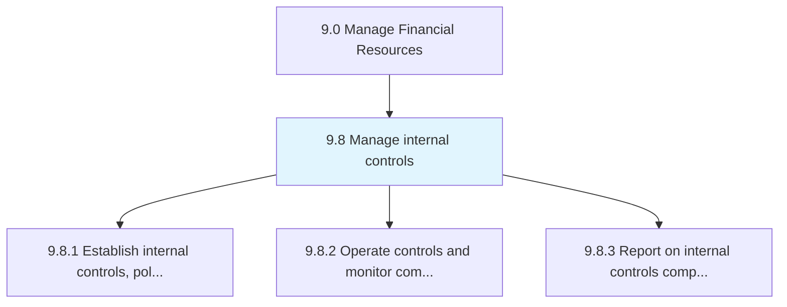
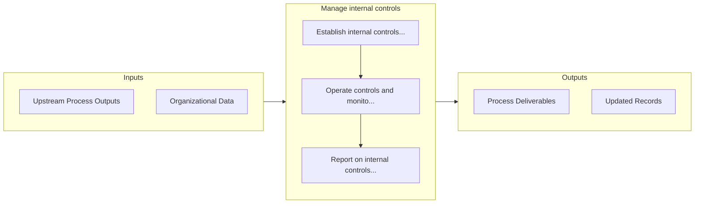

# Manage internal controls

> Administering internal controls.

## Overview

Group 9.8 is a process group within APQC Category 9.0 (Manage Financial Resources). 

Administering internal controls. This process requires the organization to manage entity's board of trustees, management, and other personnel in order to offer judicious assurance about the achievement of effectiveness, proficiency of operations, and reliability of financial reporting.

## Process Hierarchy



## Key Statistics

| Metric | Value |
|--------|-------|
| APQC Code | 10735 |
| Hierarchy ID | 9.8 |
| Level | Group |
| Parent | [9](../) |
| Sub-Processes | 3 |


## GraphDL Semantic Structure

```graphdl
manage.InternalControls
```

| Component | Value | Description |
|-----------|-------|-------------|
| Verb | `manage` | Primary action |
| Object | `internal controls` | Direct object |


## Process Flow



## Sub-Processes

| Process | Hierarchy ID | Description |
|---------|-------------|-------------|
| [Establish internal controls, policies, and procedures](./9.8.1-EstablishInternalControlsPolicies/) | 9.8.1 | Forming rules and regulations to ensure the achievement of effectiveness, proficiency of operations, |
| [Operate controls and monitor compliance with internal controls policies and procedures](./9.8.2-OperateControlsMonitorCompliance/) | 9.8.2 | Performing planning, management, operations, and monitoring of internal control mechanism policies a |
| [Report on internal controls compliance](./9.8.3-ReportInternalControlsCompliance/) | 9.8.3 | Reporting on internal controls compliance to the appropriate authority, including IT regulations and |


## Related Concepts

- InternalControls


---

*Source: APQC PCF 10735 (9.8) - APQC*
