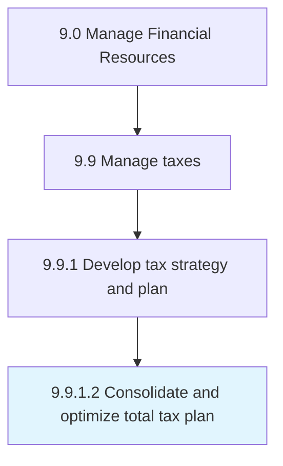

# Consolidate and optimize total tax plan

> Combining and enhancing a rational analysis of a financial condition or plan from a tax perspective in order to align financial goals through efficient tax planning.

## Overview

Activity 9.9.1.2 is an activity within the Manage Financial Resources framework. 

Combining and enhancing a rational analysis of a financial condition or plan from a tax perspective in order to align financial goals through efficient tax planning.

## Process Hierarchy



## Key Statistics

| Metric | Value |
|--------|-------|
| APQC Code | 10928 |
| Hierarchy ID | 9.9.1.2 |
| Level | Activity |
| Parent | [9.9.1](../) |
| Sub-Processes | 0 |


## GraphDL Semantic Structure

```
consolidate.AndOptimizeTotalTaxPlan
```

| Component | Value | Description |
|-----------|-------|-------------|
| Verb | `consolidate` | Primary action |
| Object | `and optimize total tax plan` | Direct object |


## Related Concepts

- TotalTaxPlan
- TotalTaxPlan


---

*Source: APQC PCF 10928 (9.9.1.2) - APQC*
