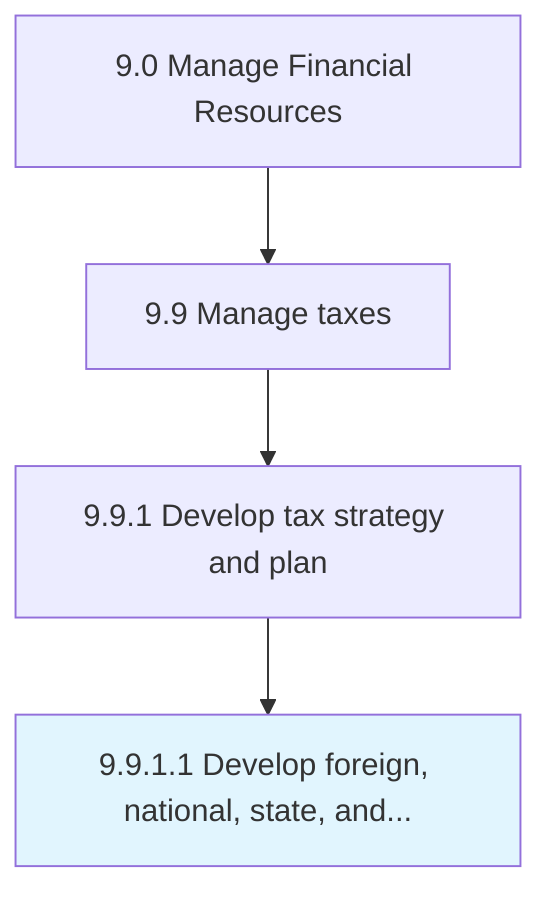

# Develop foreign, national, state, and local tax strategy

> Developing a tax strategy for foreign, national, state, local administration.

## Overview

Activity 9.9.1.1 is an activity within the Manage Financial Resources framework. 

Developing a tax strategy for foreign, national, state, local administration. Set up tax strategies for foreign trade in imports and exports and at national, state, and local level.

## Process Hierarchy



## Key Statistics

| Metric | Value |
|--------|-------|
| APQC Code | 10927 |
| Hierarchy ID | 9.9.1.1 |
| Level | Activity |
| Parent | [9.9.1](../) |
| Sub-Processes | 0 |


## GraphDL Semantic Structure

```
develop.ForeignNationalStateAndLocalTaxStrategy
```

| Component | Value | Description |
|-----------|-------|-------------|
| Verb | `develop` | Primary action |
| Object | `foreign, national, state, and local tax strategy` | Direct object |


## Related Concepts

- [Foreign](/concepts/Foreign)
- [National](/concepts/National)
- [State](/concepts/State)
- [LocalTaxStrategy](/concepts/LocalTaxStrategy)


---

*Source: APQC PCF 10927 (9.9.1.1) - APQC*
