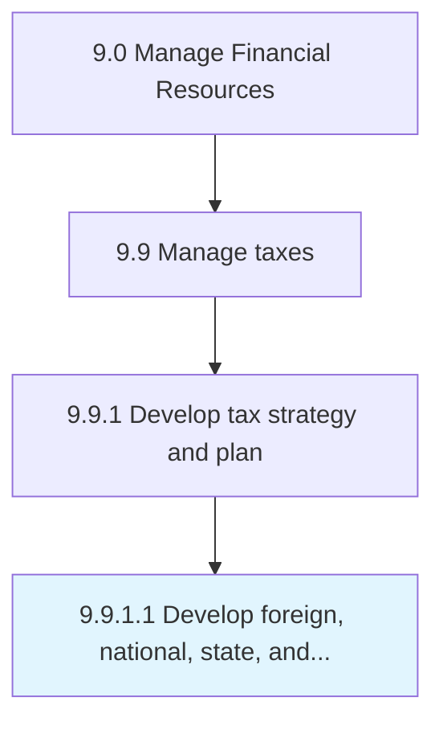

# Develop foreign, national, state, and local tax strategy

> Developing a tax strategy for foreign, national, state, local administration.

## Overview

Activity 9.9.1.1 is an activity within the Tax Management domain of the Manage Financial Resources framework.

Developing a tax strategy for foreign, national, state, local administration. This activity plays a critical role in ensuring that the organization maintains sound financial governance, operational efficiency, and regulatory compliance. It supports upstream planning and downstream execution by providing structured outputs that inform decision-making across finance and business operations. Effective execution of this activity requires coordination among finance professionals, process owners, and leadership stakeholders to ensure accuracy, timeliness, and alignment with organizational objectives.

## Process Hierarchy



## Process Flow


## Key Statistics

| Metric | Value |
|--------|-------|
| APQC Code | 10927 |
| Hierarchy ID | 9.9.1.1 |
| Level | Activity |
| Parent | [9.9.1](../) |
| Sub-Processes | 0 |

## GraphDL Semantic Structure

```graphdl
develop.ForeignNationalStateAndLocalTaxStrategy
```

| Component | Value | Description |
|-----------|-------|-------------|
| Verb | `develop` | Primary action |
| Object | `foreign, national, state, and local tax strategy` | Direct object |

## RACI Matrix

| Activity | Responsible | Accountable | Consulted | Informed |
|----------|-------------|-------------|-----------|----------|
| Prepare tax returns | Tax Analyst | Tax Director | External Tax Advisor | CFO |
| Manage tax provision | Tax Manager | Tax Director | Controller | CFO |
| Plan tax strategy | Tax Director | CFO | Legal Counsel | Board |

## Related Occupations

- [Financial Managers](/occupations/Management/FinancialManagers)
- [Accountants and Auditors](/occupations/Business/Financial/AccountantsAndAuditors)
- [Tax Preparers](/occupations/Business/TaxPreparers)
- [Tax Examiners and Collectors](/occupations/TaxExaminersCollectorsAndRevenueAgents)
- [Financial Analysts](/occupations/Business/Financial/FinancialAnalysts)

## Related Departments

- Tax
- Legal & Compliance
- Finance & Accounting

## Industry Variations

### Multinational Corporations

Tax management spans transfer pricing, permanent establishment risks, BEPS compliance, and multi-jurisdiction filing obligations.

### Real Estate

Tax planning leverages depreciation strategies, 1031 exchanges, opportunity zones, and REIT structure optimization.

### Technology

Manages R&D tax credits, IP holding structures, and digital services tax obligations across jurisdictions.

## KPIs & Metrics

| Metric | Description | Target |
|--------|-------------|--------|
| Effective Tax Rate | Total tax expense as percentage of pre-tax income | At or below statutory rate |
| Tax Filing Timeliness | On-time filing of all tax returns | 100% |
| Tax Audit Adjustments | Value of audit-imposed adjustments | < 1% of tax liability |
| Tax Provision Accuracy | Accuracy of quarterly tax provision | > 98% |

## Related Concepts

- Foreign
- National
- State
- LocalTaxStrategy

---

*Source: APQC PCF 10927 (9.9.1.1) - APQC*