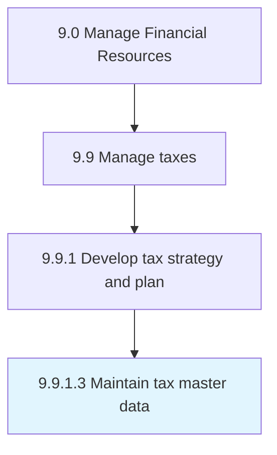

# Maintain tax master data

> Maintaining a master file about the rational analysis of a financial condition or plan from a tax perspective in order to align financial goals through efficient tax planning.

## Overview

Activity 9.9.1.3 is an activity within the Manage Financial Resources framework. 

Maintaining a master file about the rational analysis of a financial condition or plan from a tax perspective in order to align financial goals through efficient tax planning.

## Process Hierarchy



## Key Statistics

| Metric | Value |
|--------|-------|
| APQC Code | 10929 |
| Hierarchy ID | 9.9.1.3 |
| Level | Activity |
| Parent | [9.9.1](../) |
| Sub-Processes | 0 |


## GraphDL Semantic Structure

```
maintain.TaxMasterData
```

| Component | Value | Description |
|-----------|-------|-------------|
| Verb | `maintain` | Primary action |
| Object | `tax master data` | Direct object |


## Related Concepts

- [TaxMasterData](/concepts/TaxMasterData)


---

*Source: APQC PCF 10929 (9.9.1.3) - APQC*
