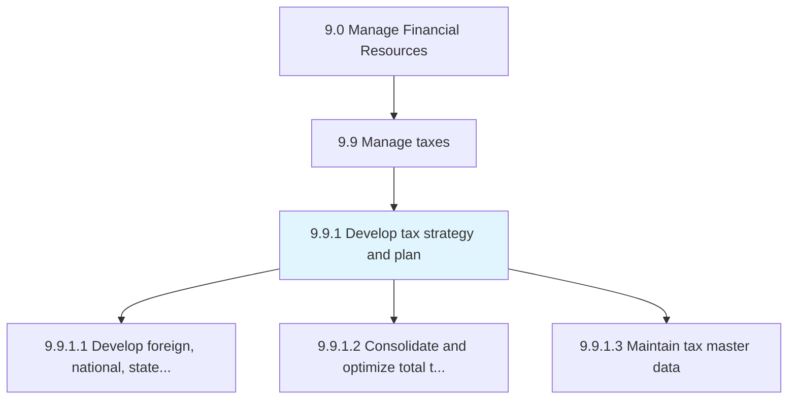
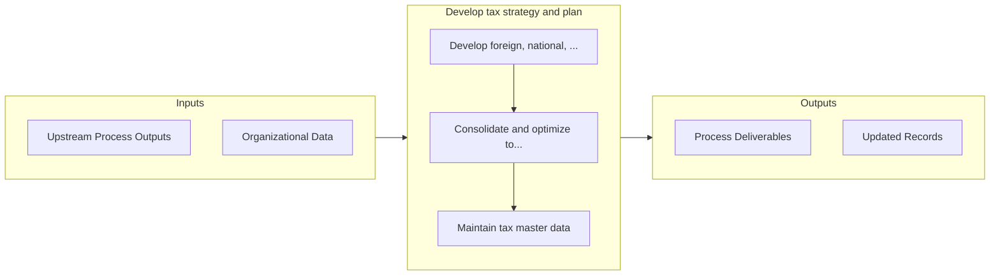

# Develop tax strategy and plan

> Setting targets for periodic tax liabilities.

## Overview

Process 9.9.1 is a core process that defines the specific procedures for develop tax strategy and plan. 

Setting targets for periodic tax liabilities. Assess the tax impact of various activities such as the acquisition or disposal of fixed assets or a deliberate change in number of employee.

## Process Hierarchy



## Key Statistics

| Metric | Value |
|--------|-------|
| APQC Code | 10765 |
| Hierarchy ID | 9.9.1 |
| Level | Process |
| Parent | [9.9](../) |
| Sub-Processes | 3 |


## GraphDL Semantic Structure

```
develop.TaxStrategyAndPlan
```

| Component | Value | Description |
|-----------|-------|-------------|
| Verb | `develop` | Primary action |
| Object | `tax strategy and plan` | Direct object |


## Process Flow



## Sub-Processes

| Process | Hierarchy ID | Description |
|---------|-------------|-------------|
| [Develop foreign, national, state, and local tax strategy](./DevelopForeignNationalStateAndLocalTaxStrategy) | 9.9.1.1 | Developing a tax strategy for foreign, national, state, local administration |
| [Consolidate and optimize total tax plan](./ConsolidateAndOptimizeTotalTaxPlan) | 9.9.1.2 | Combining and enhancing a rational analysis of a financial condition or plan from a tax perspective  |
| [Maintain tax master data](./MaintainTaxMasterData) | 9.9.1.3 | Maintaining a master file about the rational analysis of a financial condition or plan from a tax pe |


## Related Concepts

- TaxStrategy
- Plan


---

*Source: APQC PCF 10765 (9.9.1) - APQC*
