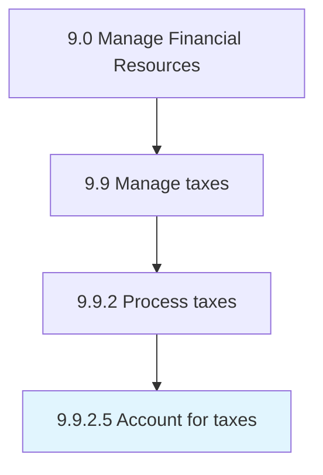

# Account for taxes

> Managing the organization's financial accounts for the purpose of taxation.

## Overview

Activity 9.9.2.5 is an activity within the Manage Financial Resources framework. 

Managing the organization's financial accounts for the purpose of taxation. Prepare and maintain the tax paid by the organization to the country they have business in.

## Process Hierarchy



## Key Statistics

| Metric | Value |
|--------|-------|
| APQC Code | 10934 |
| Hierarchy ID | 9.9.2.5 |
| Level | Activity |
| Parent | [9.9.2](../) |
| Sub-Processes | 0 |


## GraphDL Semantic Structure

```
account.ForTaxes
```

| Component | Value | Description |
|-----------|-------|-------------|
| Verb | `account` | Primary action |
| Object | `for taxes` | Direct object |


## Related Concepts

- Taxes


---

*Source: APQC PCF 10934 (9.9.2.5) - APQC*
