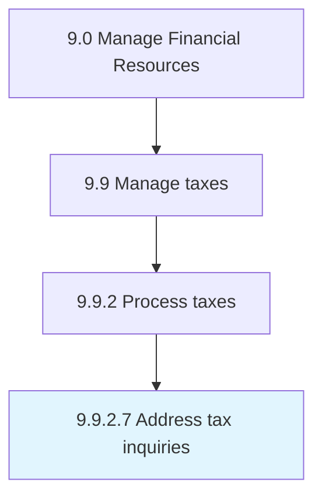

# Address tax inquiries

> Addressing any tax queries by any regulatory or government authorities.

## Overview

Activity 9.9.2.7 is an activity within the Manage Financial Resources framework. 

Addressing any tax queries by any regulatory or government authorities. Review historical records related to taxation within the organization in order to respond to queries.

## Process Hierarchy



## Key Statistics

| Metric | Value |
|--------|-------|
| APQC Code | 10936 |
| Hierarchy ID | 9.9.2.7 |
| Level | Activity |
| Parent | [9.9.2](../) |
| Sub-Processes | 0 |


## GraphDL Semantic Structure

```
address.TaxInquiries
```

| Component | Value | Description |
|-----------|-------|-------------|
| Verb | `address` | Primary action |
| Object | `tax inquiries` | Direct object |


## Related Concepts

- TaxInquiries


---

*Source: APQC PCF 10936 (9.9.2.7) - APQC*
