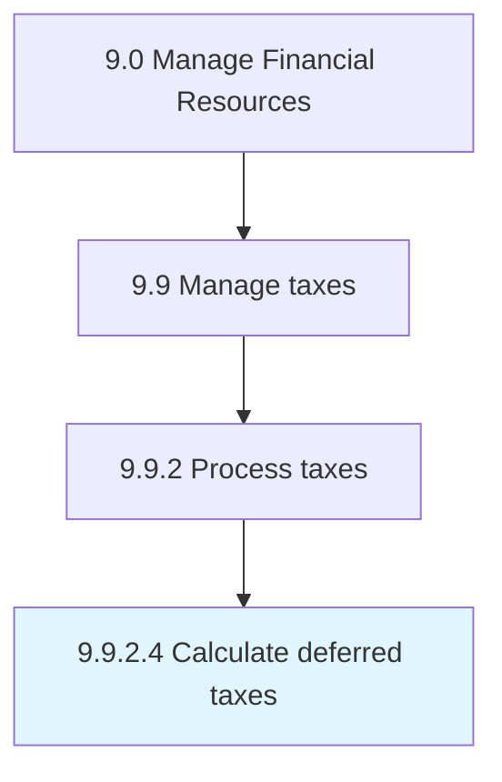

# Calculate deferred taxes

> Calculating the income that has been realized when the tax on that income has not.

## Overview

Activity 9.9.2.4 is an activity within the Manage Financial Resources framework. 

Calculating the income that has been realized when the tax on that income has not.

## Process Hierarchy



## Key Statistics

| Metric | Value |
|--------|-------|
| APQC Code | 10933 |
| Hierarchy ID | 9.9.2.4 |
| Level | Activity |
| Parent | [9.9.2](../) |
| Sub-Processes | 0 |


## GraphDL Semantic Structure

```
calculate.DeferredTaxes
```

| Component | Value | Description |
|-----------|-------|-------------|
| Verb | `calculate` | Primary action |
| Object | `deferred taxes` | Direct object |


## Related Concepts

- [DeferredTaxes](/concepts/DeferredTaxes)


---

*Source: APQC PCF 10933 (9.9.2.4) - APQC*
